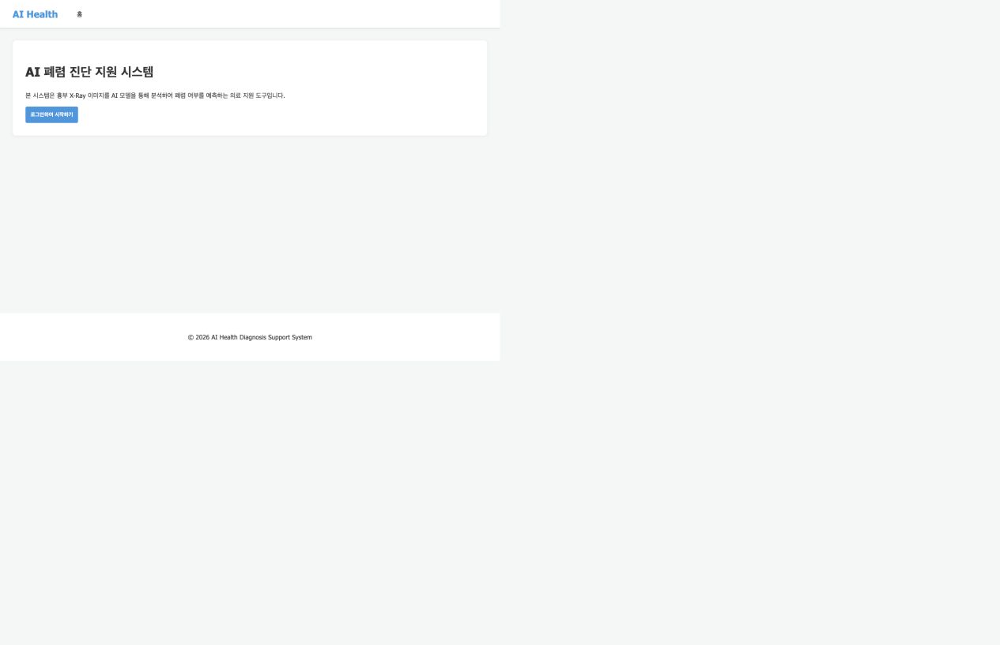
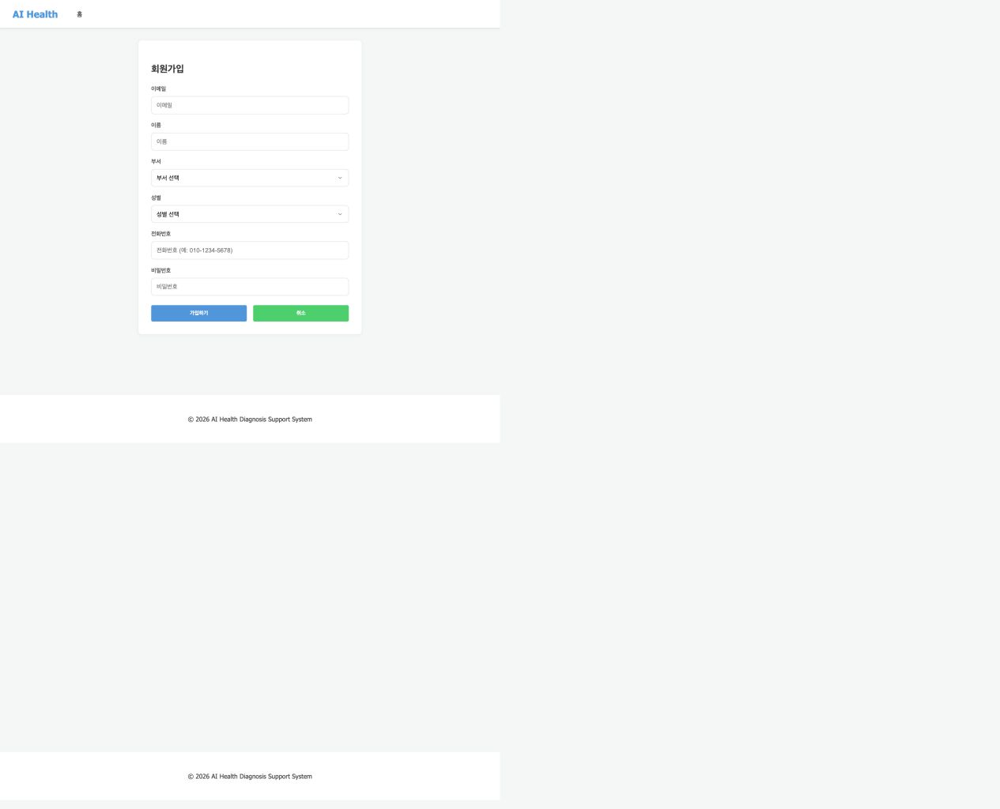
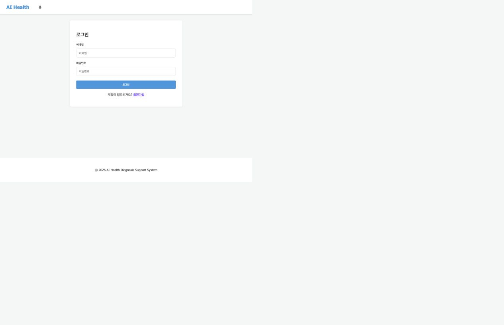
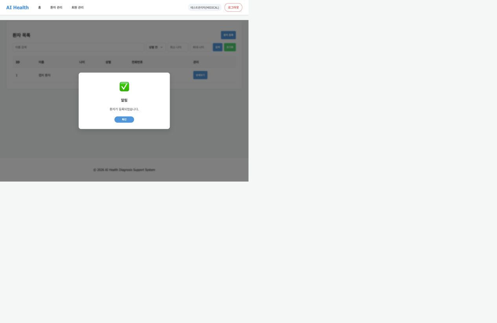
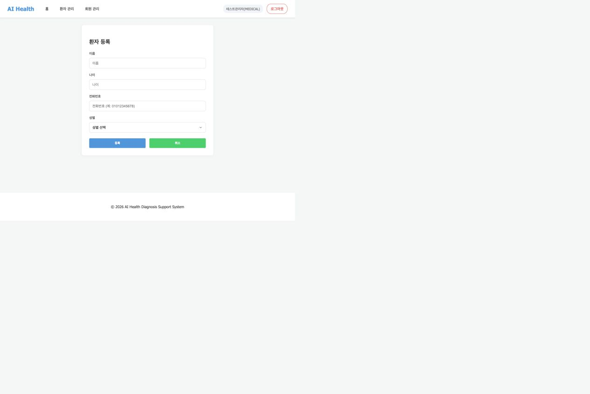
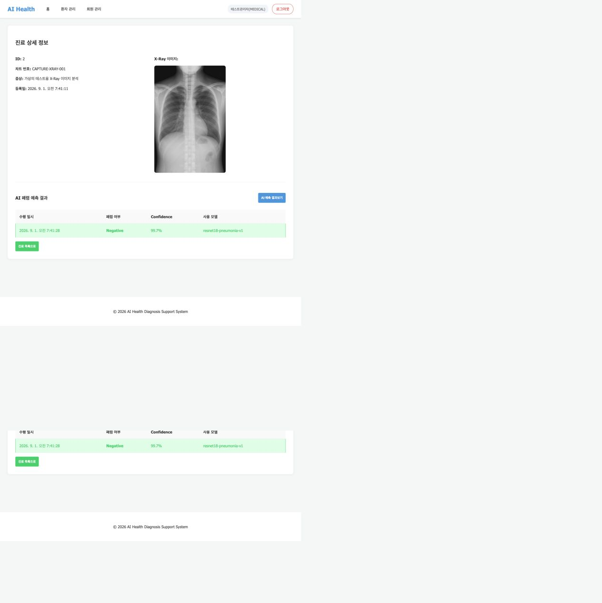

# 7일차 앱 실행 화면 및 프론트엔드 API 연결

## 실행 및 확인 환경

프로젝트 루트에서 다음 명령으로 FastAPI 앱을 실행했다.

```bash
fastapi run app/main.py
```

브라우저에서 `http://127.0.0.1:8000/`로 접속해 화면을 확인했다. 과제 안내의 `http://0.0.0.0:8000/`도 같은 로컬 서버를 가리키지만, 브라우저 접속에는 `127.0.0.1` 또는 `localhost`를 사용할 수 있다.

자동 API 계약 테스트 결과는 **4 passed**이며, `/`와 `/static/apis.js`도 모두 `200 OK`로 응답했다.

## 실행 화면

### 홈 화면



홈 화면은 로그인하지 않은 사용자가 서비스 소개를 확인하고 로그인 화면으로 이동하는 시작 지점이다. `GET /` 요청은 FastAPI의 `index()`가 `static/index.html`을 반환하며, 화면 전환은 `static/app.js`와 `static/pages.js`가 담당한다.

### 회원가입 화면



회원가입 폼은 이메일, 비밀번호, 이름, 부서, 성별, 전화번호를 입력받는다. 부서와 성별 선택 값은 백엔드 enum과 일치하도록 `DEV`, `MEDICAL`, `RESEARCH`, `M`, `F`를 사용한다.

### 로그인 화면



로그인 폼 제출 시 `pages.handleLogin()`이 호출되고, 공통 API 모듈의 `apis.login(email, password)`가 JSON 본문을 전송한다. 로그인 성공 시 Access Token을 저장한 뒤 내 정보 API를 호출해 화면 권한을 갱신한다.

### 환자 목록 및 등록 화면





관리자 계정으로 로그인한 뒤 환자 등록 폼에서 가상 환자를 등록했고, 등록 결과가 환자 목록에 즉시 표시되는 것을 확인했다. 이 과정에서 `POST /api/v1/patients`와 `GET /api/v1/patients`가 순서대로 동작한다.

### X-Ray 업로드 및 AI 예측 결과 화면



진료기록 등록 화면에서 X-Ray 파일을 첨부한 뒤 `POST /api/v1/patients/{patient_id}/medical-records`를 호출했다. 이어서 진료기록 상세의 **AI 예측 결과보기** 버튼으로 `POST /api/v1/medical-records/{record_id}/predictions`를 호출했고, 결과 화면에 저장된 예측 결과가 표시되는 것을 확인했다. 캡처에서는 앱 모델의 출력이 `Negative`, 신뢰도 `99.7%`, 모델명 `resnet18-pneumonia-v1`로 나타난다. 이는 과제의 화면·API 연동 확인을 위한 모델 출력이며, 의료 진단을 대체하지 않는다.

## 프론트엔드 API 호출 구조

```text
사용자 입력/버튼 클릭
  → static/pages.js (화면별 이벤트 처리)
  → static/apis.js (요청 경로·메서드·본문 구성)
  → /api/v1/... FastAPI 라우터
  → JSON 응답
  → static/pages.js (목록·상세 화면 렌더링)
```

`static/apis.js`의 `API_BASE`는 `/api/v1`이다. 로그인 후에는 `state.token`을 읽어 모든 보호 API 요청의 `Authorization: Bearer <access_token>` 헤더에 자동으로 추가한다. Access Token이 만료되어 `401`이 반환되면 `/users/token/refresh`로 갱신을 시도한 뒤 원래 요청을 한 번 더 수행한다.

## Endpoint별 프론트엔드 동작

| 백엔드 endpoint | 프론트엔드 동작 |
| --- | --- |
| `POST /api/v1/users/signup` | 회원가입 화면의 `handleSignup()`이 JSON 회원 정보를 `apis.signup()`으로 전달한다. 성공 시 로그인 화면으로 이동한다. |
| `POST /api/v1/users/login` | 로그인 화면의 `handleLogin()`이 이메일·비밀번호를 JSON으로 전송한다. 성공 시 Access Token을 저장하고 `GET /users/me`로 사용자 상태를 확인한다. |
| `POST /api/v1/users/token/refresh` | 공통 요청 함수가 `401`을 받았을 때 Refresh Cookie로 Access Token을 재발급받는다. |
| `POST /api/v1/users/logout` | 내비게이션의 로그아웃 버튼이 호출한다. 서버 로그아웃 후 브라우저 토큰과 로그인 상태를 제거한다. |
| `GET /api/v1/users/me` | 앱 시작 및 로그인 직후 `checkAuth()`가 호출한다. 반환된 역할에 따라 환자·관리자 메뉴 접근을 제어한다. |
| `PATCH /api/v1/users/me` | 마이페이지에서 부서·전화번호를 수정할 때 JSON으로 전송한다. |
| `PATCH /api/v1/users/me/password` | 마이페이지 비밀번호 변경 폼에서 현재 비밀번호와 새 비밀번호를 전송한다. |
| `DELETE /api/v1/users/me` | 회원 탈퇴 확인 후 호출하고, 성공하면 로그아웃 처리한다. |
| `GET /api/v1/users` | 관리자 회원 관리 화면에서 이름/이메일 검색 및 부서 필터와 함께 호출한다. 응답의 `items` 배열을 표로 렌더링한다. |
| `PATCH /api/v1/users/{user_id}/role` | 관리자 화면에서 역할 선택 값을 바꾸면 `{ role }` JSON 본문과 함께 호출한다. |
| `POST /api/v1/patients` | 환자 등록 폼의 이름·나이·성별·전화번호를 JSON으로 전송한다. |
| `GET /api/v1/patients` | 환자 목록 진입 및 검색 시 호출한다. `name`, `gender`, `min_age`, `max_age` 쿼리로 필터링하고 `items`를 표에 표시한다. |
| `GET /api/v1/patients/{patient_id}` | 환자 상세 화면에서 기본 환자 정보를 표시한다. |
| `PATCH /api/v1/patients/{patient_id}` | 환자 상세의 수정 모달에서 이름·전화번호를 JSON으로 전송한다. |
| `DELETE /api/v1/patients/{patient_id}` | 삭제 확인 모달의 확인 버튼이 호출한다. 성공 시 환자 목록으로 이동한다. |
| `GET /api/v1/patients/{patient_id}/medical-records` | 환자 상세 화면에서 해당 환자의 진료기록 목록을 불러와 표에 표시한다. |
| `POST /api/v1/patients/{patient_id}/medical-records` | 진료기록 등록 화면이 `FormData`로 차트 번호, 증상, 선택한 X-Ray 이미지를 전송한다. |
| `GET /api/v1/patients/{patient_id}/medical-records/{record_id}` | 진료기록 상세 화면에서 증상·등록일·X-Ray 이미지를 표시한다. |
| `POST /api/v1/medical-records/{record_id}/predictions` | 진료기록 상세의 AI 예측 버튼이 호출한다. 예측 완료 후 같은 진료기록 상세 화면을 다시 불러온다. |
| `GET /api/v1/medical-records/{record_id}/predictions` | 진료기록 상세 진입 시 저장된 AI 예측 결과 목록을 가져와 결과 표로 렌더링한다. |

## 팀 작업 시 확인할 점

- 화면별 이벤트는 `static/pages.js`, API 요청 공통 처리는 `static/apis.js`에 둔다.
- 백엔드의 endpoint·HTTP 메서드·요청 본문·응답 필드가 변경되면 `apis.js`와 화면 렌더링 코드를 함께 수정한다.
- API 키나 비밀값은 프론트엔드 및 Git에 넣지 않는다. 이 앱의 인증 토큰은 로그인 이후에만 브라우저에서 사용한다.
- API 변경 후에는 FastAPI 앱을 실행하고 브라우저 화면을 확인한 뒤, `pytest -q`로 계약 테스트를 다시 실행한다.
