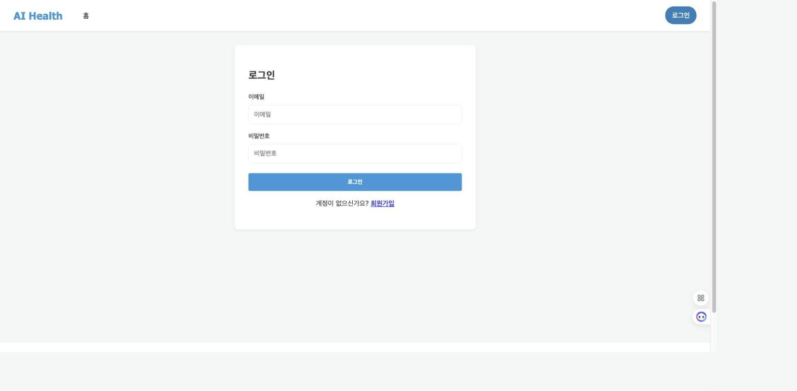
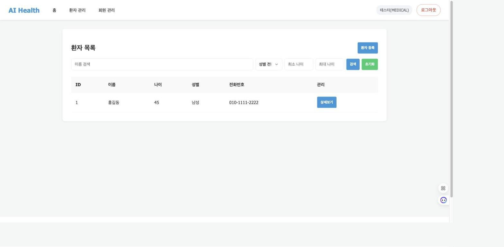
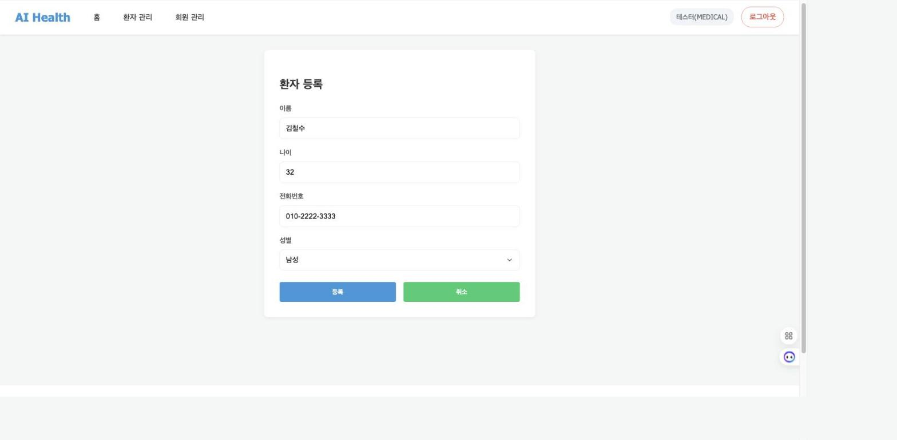
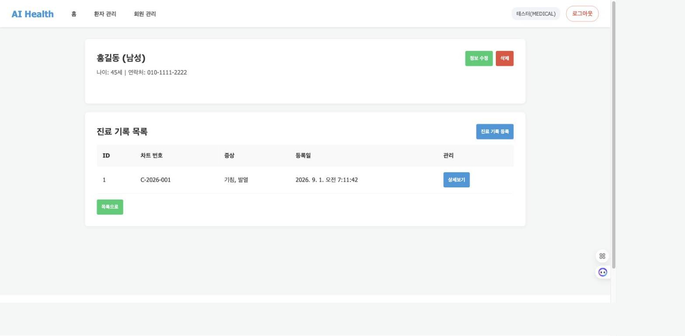
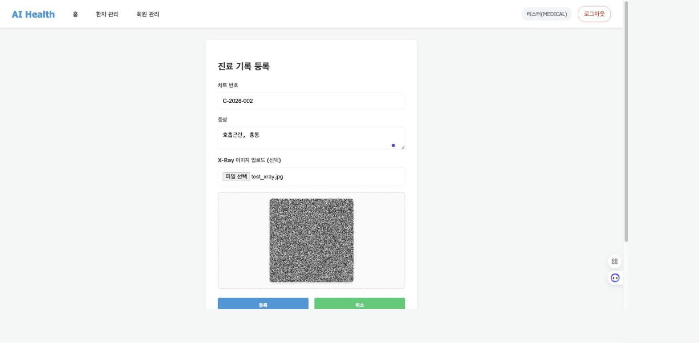
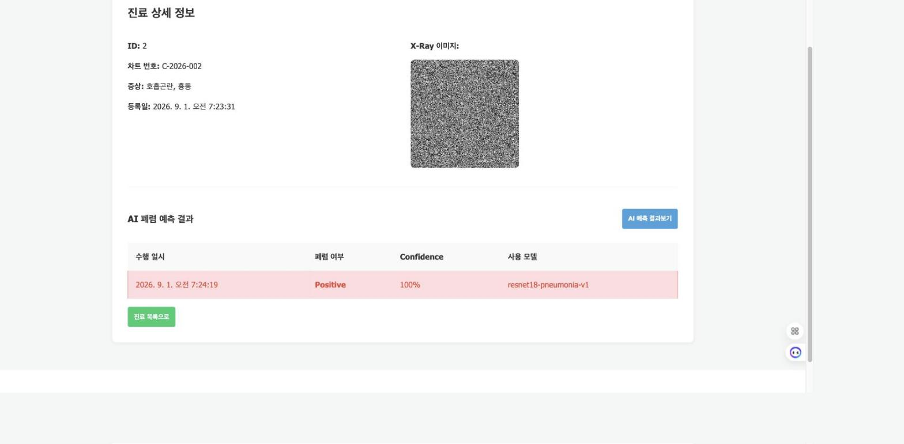
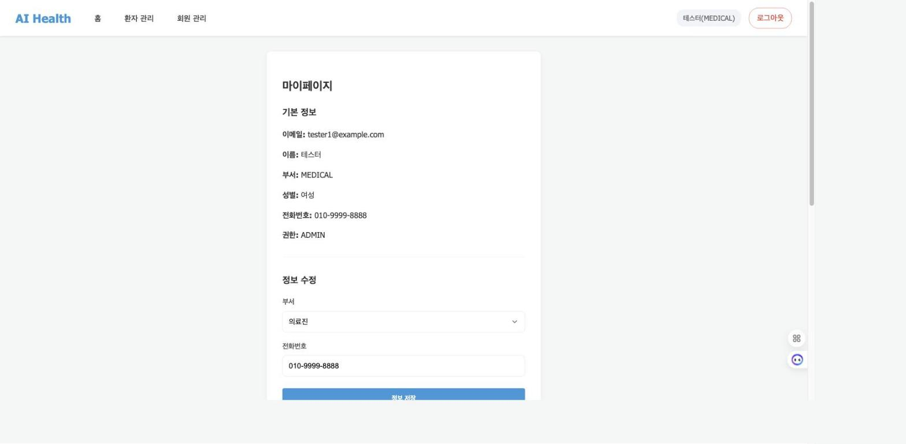
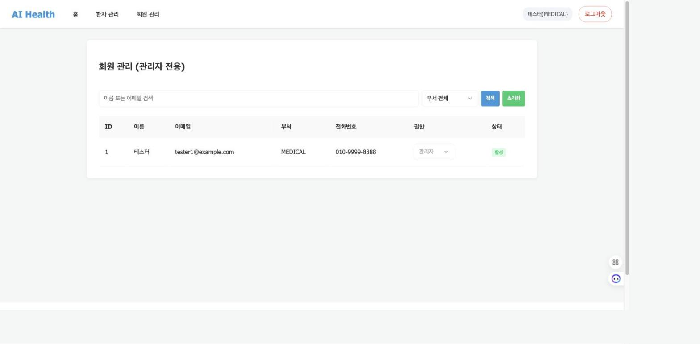

# 7일차 - 앱 실행 화면 (프론트엔드-백엔드 연동 확인)

## 1. 개요
`static/` 폴더의 프론트엔드 템플릿은 과제 초기에 제공된 보일러플레이트로, 실제로 구현된 백엔드 API 명세와 일부 다른 부분(요청 형식, URL 경로, enum 값 대소문자 등)이 있었습니다. 이를 백엔드 API 명세에 맞게 수정한 뒤, `fastapi run app/main.py`로 앱을 실행하고 브라우저에서 각 endpoint를 직접 호출하며 정상 동작을 확인했습니다.

- 실행 방법: `fastapi run app/main.py` 실행 후 `http://0.0.0.0:8000/` 접속
- 테스트 계정: `MEDICAL` 부서 / `ADMIN` 권한 유저로 로그인하여 전 기능 접근 가능한 상태로 테스트

---

## 2. 로그인 (`POST /api/v1/users/login`)
이메일/비밀번호로 로그인하면 access token을 응답 본문으로, refresh token을 httponly 쿠키로 발급받습니다. 로그아웃 시 `POST /api/v1/users/logout` 호출 후 로그인 화면으로 리다이렉트됩니다.

- 로그인 성공 → `/patients`(환자 목록)로 자동 이동 확인
- 로그아웃 → `/login`으로 정상 리다이렉트, 토큰 쿠키/로컬스토리지 정리 확인

---

## 3. 환자 목록 조회 (`GET /api/v1/patients`)
로그인 후 "환자 관리" 메뉴에서 등록된 환자 목록을 조회합니다. 이름 검색, 성별/나이 필터가 쿼리 파라미터로 정상 전달되는 것을 확인했습니다.

---

## 4. 환자 등록 (`POST /api/v1/patients`)
"환자 등록" 버튼으로 이동하여 이름/나이/전화번호/성별을 입력하고 등록하면, 환자 목록에 즉시 반영됩니다.

- 등록 성공 시 "환자가 등록되었습니다" 알림 후 목록 페이지로 이동
- DB(`patients` 테이블)에 실제 저장되는 것까지 확인

---

## 5. 환자 상세 조회 (`GET /api/v1/patients/{id}`, `GET /api/v1/patients/{id}/medical-records`)
환자 목록에서 "상세보기"를 클릭하면 환자 기본 정보와 해당 환자의 진료 기록 목록이 함께 표시됩니다.

---

## 6. 진료 기록 등록 + X-Ray 업로드 (`POST /api/v1/patients/{id}/medical-records`)
환자 상세 페이지에서 "진료 기록 등록"으로 이동하여 차트번호/증상을 입력하고 X-Ray 이미지를 업로드하면, 업로드한 이미지가 미리보기로 표시되고 등록 시 서버에 저장됩니다.

---

## 7. AI 폐렴 예측 실행/조회 (`POST`, `GET /api/v1/medical-records/{id}/predictions`)
진료 기록 상세 페이지에서 "AI 예측 결과보기" 버튼을 누르면 등록된 X-Ray 이미지로 ResNet18 기반 폐렴 예측이 실행되고, 결과(양성/음성, Confidence, 사용 모델)가 목록으로 표시됩니다.

- "AI 예측이 완료되었습니다" 알림 확인
- 같은 모델로 재요청 시 캐시된 결과를 재사용(재추론 없이 응답)하는 것도 확인

---

## 8. 마이페이지 조회/수정 (`GET`, `PATCH /api/v1/users/me`)
우측 상단 유저 이름을 클릭하면 마이페이지로 이동하며, 기본 정보 조회와 부서/전화번호 수정이 가능합니다.

- 전화번호 수정 후 "회원 정보가 수정되었습니다" 알림과 함께 값이 즉시 반영되는 것을 확인

---

## 9. 회원 관리 (관리자 전용) (`GET /api/v1/users`, `PATCH /api/v1/users/{id}/role`)
ADMIN 권한 유저만 접근 가능한 페이지로, 전체 회원 목록 조회 및 이름/이메일 검색, 부서 필터가 정상 동작합니다.

---

## 10. 결론
프론트엔드 템플릿과 백엔드 API 간 존재하던 다음 불일치를 모두 수정하고, 위 모든 endpoint를 실제 브라우저 클릭 테스트로 검증했습니다.

- 로그인 요청 형식(form → JSON)
- 토큰 갱신 URL(`/users/refresh` → `/users/token/refresh`)
- 관리자 API 경로 및 응답 구조(`/admin/users` → `/users`, 목록 응답 `{items}` 언래핑)
- AI 예측 API 경로(`/predict`, `/analyses` → `/predictions`)
- role/gender enum 대소문자(`pending/staff/admin` → `PENDING/STAFF/ADMIN`, `male/female` → `M/F`)
- 검색 쿼리 파라미터명(`query` → `search`)
