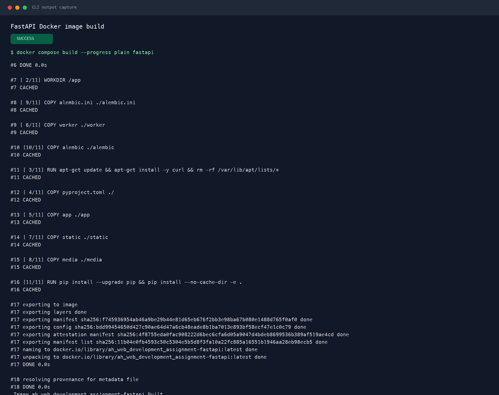
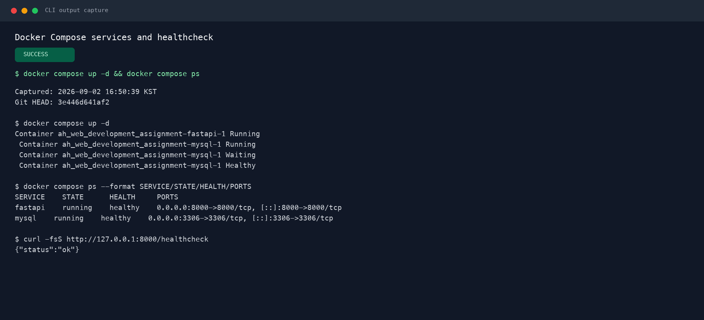

# 8일차 Docker Compose 빌드 및 실행 확인

## 1. 검증 환경

- 검증 일시: 2026-09-02 16:50 KST
- Git 브랜치: `bjcoding`
- 검증 기준 HEAD: `3e446d641af2`
- Docker build context: 프로젝트 루트 (`.`)
- Dockerfile: `app/Dockerfile`

루트 `.dockerignore`는 실제 build context에 적용되며, 과제 확인 경로인 `app/.dockerignore`에도 같은 제외 규칙을 유지한다. 환경 파일, Python 및 라이브러리 캐시, Docker 설정, 문서, README, IDE 설정은 이미지 build context에서 제외한다.

## 2. FastAPI 이미지 빌드

다음 명령으로 현재 소스의 FastAPI 이미지를 빌드했다.

```bash
docker compose build --progress plain fastapi
```

빌드 결과 `ah_web_development_assignment-fastapi:latest` 이미지가 정상 생성됐다.



## 3. Compose 서비스 실행

다음 명령으로 FastAPI와 MySQL 서비스를 실행하고 상태를 확인했다.

```bash
docker compose up -d
docker compose ps
curl -fsS http://127.0.0.1:8000/healthcheck
```

확인 결과:

- `fastapi`: `running`, `healthy`, 호스트 포트 `8000`
- `mysql`: `running`, `healthy`, 호스트 포트 `3306`
- FastAPI healthcheck: `{"status":"ok"}`
- FastAPI는 MySQL healthcheck 이후 Alembic migration과 테스트 계정 bootstrap을 거쳐 `--reload` 옵션으로 실행된다.



## 4. 캡처 방식

macOS 자동화 정책상 Terminal과 Docker Desktop 화면을 직접 캡처할 수 없어, 실제로 실행한 Compose 명령의 원문 출력을 `/tmp` 로그로 보존한 뒤 터미널 스타일 PNG로 렌더링했다. 이미지는 재작성한 예시가 아니라 같은 검증 실행에서 수집한 CLI 출력이며, 상단에 `CLI output capture`라고 표시했다. 환경변수 값과 비밀번호는 포함하지 않았다.
