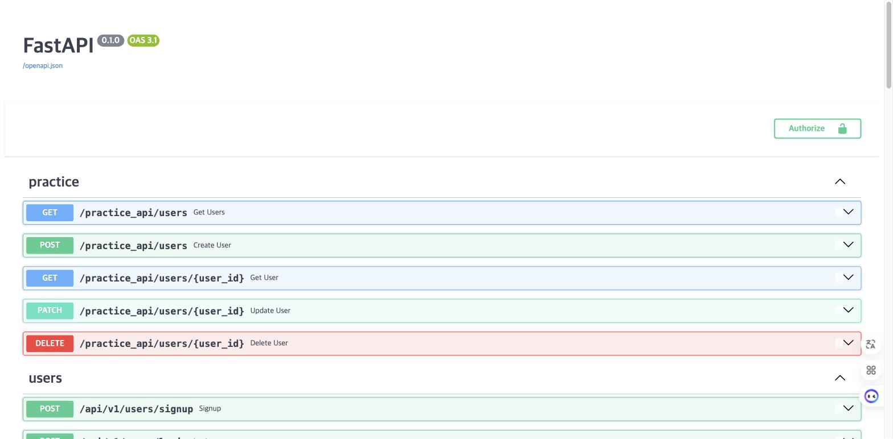

# 8일차 - Docker 컨테이너화 (Stage 1)

## 1. 개요
Notion Stage 1 과제에 따라 FastAPI 앱을 컨테이너로 빌드/실행할 수 있도록 아래 파일을 작성했습니다.

- `app/Dockerfile`: FastAPI 앱 이미지 빌드용 Dockerfile (기존에 빈 파일로만 존재하던 것을 작성)
- `.dockerignore` / `app/.dockerignore`: 이미지 경량화 및 보안을 위한 제외 목록
- `docker-compose.yml`: 초기 세팅 때 이미 작성되어 있던 파일을 실제 빌드·실행 테스트하며 발견한 버그 수정

빌드 컨텍스트는 `docker-compose.yml`의 `build.context: .` 설정에 따라 **프로젝트 루트**이고, `dockerfile: app/Dockerfile`로 지정되어 있습니다. 지침상 `.dockerignore`는 `app/` 하위에 두라고 되어 있지만, Docker는 빌드 컨텍스트 루트(프로젝트 루트)의 `.dockerignore`를 기준으로 파일을 제외하므로, 실제 동작을 위해 **루트에도 동일한 내용을 두었습니다**.

---

## 2. 실행 방법
```bash
docker compose build
docker compose up -d
curl http://localhost:8000/healthcheck
```
- `fastapi` 서비스: 로컬 코드가 컨테이너 `/app`에 마운트되어 `--reload`로 즉시 반영됨
- `mysql` 서비스: `.env`의 `DB_*` 값으로 초기화됨 (최초 실행 시 `docker compose exec fastapi uv run alembic upgrade head`로 마이그레이션 필요)

---

## 3. 실제 빌드/실행 중 발견한 이슈와 수정

로컬에서 직접 `docker compose build` → `docker compose up`을 돌려보며 검증하는 과정에서, 기존에 스캐폴딩되어 있던 `docker-compose.yml`에 실제로는 동작하지 않는 지점이 3가지 있어 함께 수정했습니다.

### 3.1 `asyncmy` 빌드 실패 (`gcc` 없음)
`python:3.13-slim` 베이스 이미지에는 빌드 도구가 없어서, 사전 빌드된 wheel이 없는 `asyncmy`(MySQL 비동기 드라이버)가 소스 빌드 중 `gcc`를 찾지 못하고 실패했습니다.
→ Dockerfile에 `apt-get install build-essential` 추가.

### 3.2 볼륨 마운트가 프로젝트 구조와 불일치
기존 설정은 `./app:/app` 이었는데, 컨테이너 `WORKDIR`이자 이미지 빌드 시 `pyproject.toml`/`uv.lock`/가상환경(`.venv`)이 위치하는 `/app`을, 파이썬 패키지 폴더인 호스트의 `app/`(즉 `main.py`, `apis/` 등만 있는 폴더)로 완전히 덮어써 버려서 컨테이너의 `.venv`와 의존성 파일들이 가려지는 문제가 있었습니다.
→ `.:/app` (프로젝트 전체 마운트)로 변경하고, 호스트의 macOS용 `.venv`가 컨테이너의 리눅스용 `.venv`를 덮어쓰지 않도록 `/app/.venv`를 익명 볼륨으로 추가해 컨테이너 내부에서 빌드된 가상환경을 보존했습니다.

### 3.3 `fastapi` 컨테이너에 DB 접속 정보가 전달되지 않음
`fastapi` 서비스에 `.env`를 넘겨주는 설정이 없어서, 컨테이너 안에서 `pydantic-settings`가 기본값(`DB_HOST=localhost`)으로 떨어져 자기 자신의 localhost에서 MySQL을 찾으려다 연결에 실패했습니다.
→ `env_file: .env`로 나머지 값(`DB_USER`, `DB_PASSWORD`, `DB_NAME` 등)을 주입하고, `environment: DB_HOST: mysql`로 도커 네트워크상의 서비스명을 명시적으로 덮어썼습니다(`.env`의 `DB_HOST=localhost`는 로컬 uv 실행용이므로 그대로 둠).

### 3.4 헬스체크가 항상 실패 (`curl` 없음)
`docker-compose.yml`의 healthcheck가 컨테이너 내부에서 `curl -f http://localhost:8000/healthcheck`를 실행하는데, `python:3.13-slim`에는 `curl`이 설치되어 있지 않아 앱이 정상 동작함에도 컨테이너가 계속 `unhealthy`로 표시되었습니다.
→ Dockerfile의 `apt-get install`에 `curl` 추가.

### 3.5 이미지 자체만 놓고 보면 기동 실패 (`worker/` 누락)
`docker compose up`(볼륨 마운트 있는 개발 환경)에서는 정상 동작했지만, 이는 `.:/app` 마운트가 호스트의 `worker/` 폴더까지 통째로 덮어써서 우연히 가려진 것이었습니다. Dockerfile이 `app/`만 이미지에 복사하고 있어서, AI 예측 로직(`app/services/prediction_service.py`가 `from worker.model import ...`로 참조)이 빠진 채였습니다. `docker run`으로 볼륨 마운트 없이 이미지 단독 실행해보니 즉시 `ModuleNotFoundError: No module named 'worker'`로 크래시하는 것을 확인했습니다.
→ Dockerfile에 `COPY worker ./worker` 추가 후, 볼륨 마운트 없는 단독 컨테이너로 재검증하여 정상 기동(healthcheck 200, `--workers 4`로 4개 프로세스 기동) 확인.

---

## 4. 실행 화면 캡처

### 4.1 컨테이너 정상 기동 (healthy)
```
$ docker compose up -d
 Container oz_codingschool-mysql-1   Started
 Container oz_codingschool-fastapi-1 Started

$ docker compose ps
NAME                        IMAGE                     STATUS                    PORTS
oz_codingschool-fastapi-1   oz_codingschool-fastapi   Up 15 seconds (healthy)   0.0.0.0:8000->8000/tcp
oz_codingschool-mysql-1     mysql:8.0                 Up 15 seconds (healthy)   0.0.0.0:3306->3306/tcp

$ curl -i http://localhost:8000/healthcheck
HTTP/1.1 200 OK
content-type: application/json

{"status":"ok"}
```
> 검증 환경에는 로컬에 이미 `mysqld`가 3306 포트를 사용 중이어서, 실제 테스트는 `DB_PORT=3307`로 호스트 포트만 임시로 바꿔 실행했습니다(컨테이너 간 통신은 항상 `mysql:3306`을 사용하므로 영향 없음). `.env`/`docker-compose.yml`에 반영된 기본값은 위와 같이 `${DB_PORT}`(기본 3306)입니다.

### 4.2 컨테이너 내부에서 실제 서빙되는 API 문서 (Swagger UI)
`http://localhost:8000/docs` — 도커 컨테이너가 서빙하는 FastAPI 앱에 브라우저로 직접 접속하여 확인한 화면입니다.



### 4.3 DB 연동까지 포함한 End-to-End 검증
마이그레이션(`alembic upgrade head`) 실행 후, 컨테이너 안에서 실제로 회원가입 → 로그인이 DB를 거쳐 정상 동작하는 것까지 확인했습니다.
```
$ curl -X POST http://localhost:8000/api/v1/users/signup -d '{...}'
{"id":1,"email":"dockertest@test.com", ... ,"role":"PENDING"}

$ curl -i -X POST http://localhost:8000/api/v1/users/login -d '{...}'
HTTP/1.1 200 OK
set-cookie: refresh_token=...; HttpOnly; ...
{"access_token":"...", "token_type":"bearer"}
```

### 4.4 이미지 단독 실행 검증 (볼륨 마운트 없이)
개발용 볼륨 마운트가 문제를 가리는 것을 방지하기 위해, 빌드된 이미지를 볼륨 없이 단독으로도 실행해 확인했습니다.
```
$ docker run -d --rm -p 8001:8000 oz_codingschool-fastapi
   FastAPI   Starting production server 🚀
    server   Server started at http://0.0.0.0:8000
      INFO   Started server process [30] ... Application startup complete.
      (4개 워커 프로세스 정상 기동)

$ curl -i http://localhost:8001/healthcheck
HTTP/1.1 200 OK
{"status":"ok"}
```

---

## 5. 완료 조건 체크
- [x] `app/Dockerfile`, `app/.dockerignore`(+루트) 작성
- [x] `docker-compose.yml`에 `fastapi`, `mysql` 서비스 정의 (볼륨 마운트, `--reload`)
- [x] `docker compose build` / `docker compose up`으로 실제 빌드·실행 검증 (헬스체크 `healthy`, DB 연동까지 확인)
- [x] 실행 화면 캡처를 `docs/images/8일차/`에 업로드
