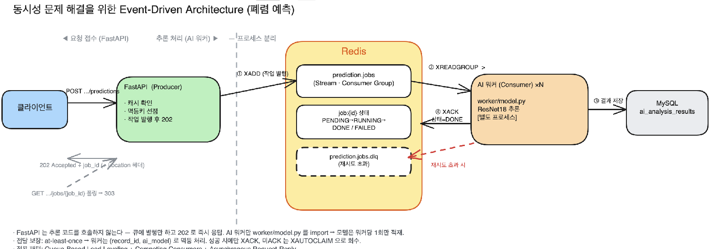
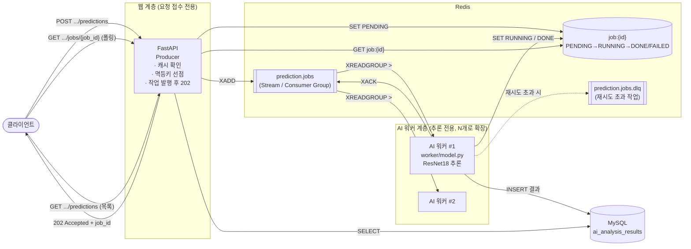

# 9일차 - 동시성 문제 해결을 위한 Event-Driven Architecture 설계

## 1. 개요

Stage 2 과제에 따라 **FastAPI + Redis 기반 Event-Driven Architecture(EDA)** 를 공부하고, 우리 프로젝트의 동시성 문제를 해결하기 위한 아키텍처를 설계한 문서입니다.

- 대상 문제: `app/services/prediction_service.py` 의 **폐렴 예측 추론이 FastAPI 프로세스 안에서 동기적으로 실행**되는 현재 구조
- 목표: 추론 작업을 **별도 AI 워커**로 분리하고, 그 사이를 **Redis 작업 대기열**로 연결하여 웹 요청과 무거운 연산을 떼어놓는다
- 산출물: 이 설계 문서 + Excalidraw 도식 (5장)

> 참고: 실제 코드 구현은 이번 단계 범위가 아니며, "이렇게 바꾼다"는 설계와 근거까지가 이 문서의 범위입니다.

---

## 2. 현재 구조와 동시성 문제 (AS-IS)

### 2.1 현재 요청 흐름

```
클라이언트
  │  POST /api/v1/medical-records/{record_id}/predictions
  ▼
FastAPI 핸들러 (prediction_apis.py)
  ▼
PredictionService.predict()               # app/services/prediction_service.py
  ├─ 캐시 조회: (record_id, ai_model) 로 ai_analysis_results 확인
  │     └─ 있으면 즉시 반환 (200)
  └─ 없으면:
        prediction = await asyncio.to_thread(_run_inference, image_path)   # ★ 여기서 ResNet18 추론
        ai_analysis_results INSERT
        return (201)
```

핵심은 `_run_inference()` 가 `worker/model.py` 의 `predict_pneumonia()`(ResNet18 전이학습 모델, CPU 추론)를 호출하고, **HTTP 요청이 이 추론이 끝날 때까지 열려 있다**는 점입니다.

### 2.2 무엇이 문제인가

| # | 문제 | 원인 | 영향 |
|---|---|---|---|
| P1 | **응답 지연 / NFR 위반** | CPU 무거운 추론이 요청 처리 경로 안에 있음. `asyncio.to_thread` 는 크기가 제한된 스레드풀을 쓰고, PyTorch 추론은 GIL 밖에서 CPU를 오래 점유 | 동시 예측 요청이 몰리면 스레드풀이 포화되어 `NFR-PRED-002`(3초 이내 응답)를 지키지 못함. 추론과 무관한 다른 API 응답까지 느려짐 |
| P2 | **중복 추론 레이스 컨디션** | 같은 `record_id` 에 대한 첫 요청 2건이 거의 동시에 들어오면, 둘 다 "캐시 없음"을 통과한 뒤 각자 추론 → 각자 INSERT | 같은 이미지를 2번 추론(자원 낭비). `ai_analysis_results` 에 `(record_id, ai_model)` 유니크 제약이 없어 중복 row가 생기거나, 있다면 한쪽이 IntegrityError |
| P3 | **워커 수평 확장 불가 / 모델 중복 적재** | 프로덕션 실행은 웹 프로세스를 여러 개(`--workers N`) 띄우는 형태인데, 각 프로세스가 import 시점에 `worker/model.py` 의 `_model` 을 각각 메모리에 올림 | 모델이 프로세스 수만큼 중복 적재되어 메모리 낭비. 추론 처리량을 늘리려면 웹 프로세스를 늘려야 하는데, 그러면 웹 동시성과 추론 동시성을 따로 조절할 수 없음 |
| P4 | **작업 유실 / 재시도 없음** | 추론 도중 프로세스가 죽으면 그 요청은 그냥 실패. 재시도·추적 수단이 없음 | 사용자가 직접 다시 눌러야 하고, 어디까지 처리됐는지 알 수 없음 |

→ 이 네 가지는 모두 **"웹 요청 처리"와 "무거운 추론 작업"이 한 프로세스 안에 묶여 있어서** 생깁니다. 둘을 분리하는 것이 EDA 설계의 출발점입니다.

---

## 3. Event-Driven Architecture(EDA) 기본 개념

서비스들이 서로를 **직접 호출**하는 대신, "이벤트(작업 요청)"라는 메시지를 중간 저장소에 던지고, 그것을 소비하는 쪽이 알아서 처리하는 구조입니다.

```
[직접 호출 방식]                         [이벤트 기반 방식]
요청 → 함수 A → (무거운 작업) → 응답        요청 → 이벤트 발행 → 브로커 → (나중에) 워커가 소비/처리
      한 프로세스가 끝까지 붙잡음                   발행 즉시 응답, 처리는 분리
```

### 3.1 구성 요소

| 요소 | 역할 | 우리 설계에서의 대응 |
|---|---|---|
| **Producer(발행자)** | 이벤트를 만들어 브로커로 보냄 | FastAPI 예측 엔드포인트 |
| **Broker/Queue(중개자)** | 이벤트를 저장하고 소비자에게 전달, 대기열 관리 | **Redis** |
| **Consumer/Worker(소비자)** | 이벤트를 꺼내 실제 작업 수행 | 별도 **AI 추론 워커 프로세스** |
| **Result store(결과 저장소)** | 처리 상태/결과 보관 | Redis(작업 상태) + MySQL(`ai_analysis_results`, 최종 결과) |

### 3.2 이 구조가 주는 이점

- **관심사 분리**: FastAPI는 "요청을 접수하고 즉시 응답", 워커는 "무거운 추론" — 각자 독립적으로 스케일
- **비동기 처리**: 클라이언트는 추론이 끝날 때까지 기다리지 않음 (접수 응답 → 이후 폴링/알림으로 결과 확인)
- **완충(buffering)**: 순간적으로 요청이 몰려도 큐에 쌓였다가 워커가 처리 가능한 속도로 소비 → 시스템이 무너지지 않음
- **신뢰성**: ACK/재시도/DLQ 로 "작업이 유실되지 않음"을 보장할 수 있음

### 3.3 이 설계가 따르는 표준 패턴 3가지

우리 설계는 새로 만든 게 아니라, 클라우드 아키텍처에서 이미 정립된 세 가지 패턴을 조합한 것입니다. (Microsoft Azure Architecture Center 기준 — 링크는 10절)

| 패턴 | 한 줄 정의 | 우리 설계에서 |
|---|---|---|
| **Queue-Based Load Leveling** (큐 기반 부하 평준화) | 작업과 서비스 사이에 **큐를 완충재로** 둬서, 요청이 몰려도 서비스는 자기 속도로 처리 | 예측 요청이 순간 폭주해도 `prediction.jobs` 큐에 쌓였다가 워커가 처리 가능한 속도로 소비. **피크가 아니라 평균 부하 기준으로 워커를 두면 됨**(비용 절감) |
| **Competing Consumers** (경쟁 소비자) | **여러 소비자가 같은 큐**에서 메시지를 나눠 가져감. 한 메시지는 **딱 한 소비자만** 처리 (Pub/Sub 과 다름) | AI 워커를 N개 띄우면 하나의 Consumer Group 안에서 작업이 자동 분배. 워커 하나가 죽어도 다른 워커가 계속 처리 |
| **Asynchronous Request-Reply** (비동기 요청-응답) | 백엔드 처리가 오래 걸릴 때, HTTP는 **`202 Accepted` + 상태 조회 URL**로 즉시 응답하고 클라이언트가 폴링 | `POST .../predictions` → `202` + `Location` 헤더(상태 엔드포인트) + `Retry-After`. 완료되면 상태 엔드포인트가 결과로 연결 |

> **주의(두 패턴 공통)**: 소비자(워커)만 무작정 늘리면 병목이 **다음 단계(MySQL)로 옮겨갈 뿐**이다. 워커 수와 DB 커넥션 풀을 함께 조율해야 실제로 평준화 효과가 난다.

### 3.4 용어 정리 — 이벤트/메시지와 전달 보장

**이벤트 vs 커맨드 vs 메시지**

| 용어 | 뜻 | 발행자가 소비자를 아는가 |
|---|---|---|
| 이벤트(Event) | "이미 일어난 사실" (과거형: `PredictionRequested`) | 모름 — 관심 있는 쪽이 알아서 구독 |
| 커맨드(Command) | "이 작업을 해달라"는 지시 (`RunPneumoniaInference`) | 앎 — 처리 주체가 정해져 있음 |
| 메시지(Message) | 이벤트/커맨드를 큐·스트림에 담아 나르는 전송 단위 | — |

> 우리 `prediction.jobs` 항목은 엄밀히는 "추론을 수행하라"는 **커맨드**에 가깝다. 다만 큐/스트림으로 전달·소비·재처리하는 **메커니즘은 이벤트와 동일**하므로, 이 문서에서는 넓은 의미의 "이벤트 기반"으로 묶어 부른다.

**전달 보장(delivery guarantee) 3가지**

| 보장 | 의미 | 유실 | 중복 | 예 |
|---|---|---|---|---|
| at-most-once | 보내고 잊음 | 있음 | 없음 | Redis **Pub/Sub** |
| **at-least-once** | ACK 받을 때까지 재전달 | 없음 | **있음** → 소비자가 멱등해야 함 | Redis **Streams**, Celery 기본, 대부분의 큐 |
| exactly-once | 정확히 한 번 | 없음 | 없음 | 전달 단계에서 진짜로 보장하는 시스템은 사실상 없음. 보통 "at-least-once + 멱등 소비자"로 **효과만** 달성 |

> **우리 선택: at-least-once + 멱등 소비자.** 워커는 추론 직전 `(record_id, ai_model)` 로 결과를 재조회하고, 이미 있으면 추론을 건너뛰고 ACK만 한다 → 같은 작업이 2번 소비돼도 결과는 1건.

### 3.5 FastAPI 내장 비동기로는 왜 부족한가

FastAPI만으로도 응답 후 작업을 이어서 할 수단이 있지만, 우리 문제(P1·P3·P4)에는 모자란다.

| 방식 | 별도 인프라 | 웹과 프로세스 분리 | 서버 재시작 후 작업 생존 | 재시도·상태추적 | 수평 확장 |
|---|---|---|---|---|---|
| `BackgroundTasks` (FastAPI 내장) | 불필요 | ❌ 웹 프로세스 안에서 실행 | ❌ | ❌ | ❌ |
| `asyncio.create_task` | 불필요 | ❌ | ❌ | 직접 구현 | ❌ |
| **외부 큐 (Celery / Redis Streams)** | **Redis 필요** | ✅ | ✅ 브로커가 작업 보관 | ✅ | ✅ 워커 N개 |

- `BackgroundTasks` / `asyncio` 는 **여전히 웹 프로세스의 CPU·메모리를 씀** → P1(응답 지연), P3(모델 중복 적재) 해결 안 됨
- 둘 다 **인메모리** → 서버가 죽으면 진행 중이던 추론은 그대로 사라짐 → P4(작업 유실)
- → "프로세스 분리 + 작업 생존 + 독립 확장"이 필요하므로 **외부 큐가 답**이고, 그 큐를 Redis로 구현한다

**왜 Redis인가 (Kafka·RabbitMQ 대신)**

| 후보 | 성격 | 우리 규모에서 |
|---|---|---|
| **Redis (Streams)** | 인메모리 데이터스토어 + 경량 스트림/큐 | 컨테이너 1개로 큐 + 작업상태 + 캐시를 한 번에. 과제 범위에 적정 |
| Kafka | 초고처리량 이벤트 스트리밍 플랫폼 | 파티션·주키퍼/KRaft 등 운영요소가 큼 — 지금 트래픽엔 과함 |
| RabbitMQ | 정통 AMQP 메시지 브로커 (라우팅 강력) | 별도 브로커 운영 추가. Celery와 잘 맞지만 Redis로도 충분 |

---

## 4. Redis를 어떻게 쓸까 — 방식 비교

Redis로 대기열을 만드는 방법은 크게 세 가지이고, 그 위에 Celery 같은 프레임워크를 얹는 선택지가 있습니다.

| 방식 | 메커니즘 | 메시지 영속/재처리 | 소비자 그룹(부하 분산) | 적합성 |
|---|---|---|---|---|
| **Pub/Sub** | `PUBLISH` / `SUBSCRIBE` | ❌ 구독자가 없으면 그 메시지는 영구 유실 | ❌ | 실시간 알림·채팅용. **작업 큐로는 부적합** |
| **List** | `LPUSH` / `BRPOP` (블로킹 팝) | △ 큐에 남아있으면 안전하지만, 팝한 뒤 처리 중 죽으면 유실. ACK 개념 없음 | △ 여러 워커가 같은 리스트를 `BRPOP` 하면 자연 분배됨 | 단순 백그라운드 작업. RQ가 이 방식 기반 |
| **Streams** | `XADD` / `XREADGROUP` / `XACK` / `XAUTOCLAIM` | ✅ 메시지가 로그로 저장됨. ACK 안 하면 pending 상태로 남아 재처리 가능 | ✅ Consumer Group 으로 여러 워커에 자동 분배 + 각 메시지 처리 추적 | **신뢰성이 필요한 작업 큐에 가장 적합** |
| **Celery (+Redis)** | Celery가 Redis를 broker(작업 전달) + result backend(결과 저장)로 사용 | ✅ 프레임워크가 재시도·타임아웃·결과조회·스케줄(Beat)을 다 제공 | ✅ 워커 프로세스/동시성(concurrency) 옵션으로 관리 | **구현 속도가 빠름**. AI Task 비동기 처리에 널리 쓰임 |

### 4.1 참고자료에서 얻은 것

- **"How to Use Redis Streams with FastAPI for Event Processing" (oneuptime, Nawaz Dhandala)** — 링크는 8절
  - FastAPI 엔드포인트가 `XADD` 로 이벤트를 스트림에 추가(`maxlen` 으로 스트림 크기 상한), 앱 startup 에서 `XGROUP CREATE ... MKSTREAM` 으로 소비자 그룹 생성
  - 워커는 `XREADGROUP` 에 특수 ID `>` 를 써서 "아직 아무도 안 가져간 새 메시지"만 `count`/`block` 옵션으로 배치 수신
  - 처리 완료 후 `XACK` → 재전달 방지. `XAUTOCLAIM` 으로 일정 시간(`min-idle-time`) 이상 ACK 안 된 메시지를 다른 워커가 회수(크래시 복구)
  - `XPENDING` 으로 소비자별 미처리 메시지 모니터링. **at-least-once 전달** 보장 → 소비자는 중복 수신을 항상 전제하고 멱등하게 짜야 함
- **"[FastAPI] Celery로 AI Task 비동기 처리하기" (velog, nickygod)** — 링크는 8절
  - 12초 넘게 걸리는 AI 작업(음성 → 텍스트 → 키워드 추출)을 요청 경로에서 떼어내는 사례
  - `BackgroundTasks` / `asyncio.create_task` 는 단일 프로세스에 갇히고 재시작 시 작업이 사라짐 → **분산 큐(Celery)** 가 필요한 이유
  - Celery 구성: Client(=FastAPI), Worker, Broker(Redis), Result Backend(Redis), Beat(스케줄)
  - `chain()` 으로 여러 task를 순차 실행(앞 task 반환값이 뒤 task 인자로 전달), **Flower**(`localhost:5555`)로 작업 진행 상황 모니터링
  - docker-compose 로 FastAPI / Celery worker / Redis / Flower 컨테이너를 함께 오케스트레이션
- **"Mastering Background Job Queues with Celery, Redis, and FastAPI" (Dhruv Ahuja)** — 링크는 8절 (유료글, 목차 기준)
  - broker vs result backend 구분, task 상태(PENDING/STARTED/SUCCESS/FAILURE), 재시도·타임아웃·에러 관리, Celery Beat 주기 실행, task chains/groups/chunks, Flower + Prometheus 모니터링

### 4.2 FastAPI + Redis 최소 연동 코드 (Streams 기준)

실제로 FastAPI와 Redis를 붙이는 골격. 이 문서의 설계를 코드로 옮기면 대략 이렇게 된다.

**(1) Redis 연결 — `lifespan` 에서 커넥션 풀 생성/정리**

```python
# app/core/redis.py
from redis.asyncio import Redis

redis: Redis | None = None

async def init_redis(url: str) -> None:
    global redis
    redis = Redis.from_url(url, decode_responses=True)

async def close_redis() -> None:
    if redis is not None:
        await redis.aclose()
```

```python
# app/main.py (발췌)
from contextlib import asynccontextmanager
from app.core.redis import init_redis, close_redis
from app.core.config import settings

@asynccontextmanager
async def lifespan(app: FastAPI):
    await init_redis(settings.REDIS_URL)   # 예: redis://redis:6379/0
    yield
    await close_redis()

app = FastAPI(lifespan=lifespan)
```

**(2) Producer — 예측 엔드포인트가 작업을 발행하고 즉시 `202`**

```python
# app/services/prediction_service.py (발췌, TO-BE)
STREAM = "prediction.jobs"

async def enqueue_prediction(self, record_id: int) -> dict:
    # 캐시 우선 (기존 로직 유지)
    cached = await self._get_cached_result(record_id)
    if cached is not None:
        return {"status": "SUCCEEDED", "result_id": cached.id, "cached": True}

    # 멱등키 선점: 이미 진행 중이면 그 job_id를 그대로 반환 (P2 방지)
    lock_key = f"pred:lock:{record_id}:{MODEL_NAME}"
    job_id = uuid4().hex
    if not await redis.set(lock_key, job_id, nx=True, ex=3600):
        job_id = await redis.get(lock_key)
        return {"status": "PENDING", "job_id": job_id}

    await redis.xadd(STREAM, {"job_id": job_id, "record_id": record_id},
                     maxlen=10000, approximate=True)
    await redis.hset(f"job:{job_id}", mapping={"status": "PENDING", "record_id": record_id})
    await redis.expire(f"job:{job_id}", 3600)
    return {"status": "PENDING", "job_id": job_id}
```

**(3) Consumer — FastAPI와 분리된 별도 프로세스(`python -m worker.stream_consumer`)**

```python
# worker/stream_consumer.py
import asyncio
from redis.asyncio import Redis
from worker.model import predict_pneumonia, MODEL_NAME

STREAM, GROUP = "prediction.jobs", "pneumonia-workers"

async def main() -> None:
    redis = Redis.from_url("redis://redis:6379/0", decode_responses=True)
    try:
        await redis.xgroup_create(STREAM, GROUP, id="0", mkstream=True)
    except Exception:
        pass  # BUSYGROUP: 이미 존재

    consumer = "worker-1"
    while True:
        resp = await redis.xreadgroup(GROUP, consumer, {STREAM: ">"},
                                      count=1, block=5000)
        for _stream, entries in resp or []:
            for msg_id, data in entries:
                try:
                    # ... (record_id로 이미지 경로 조회 → 추론 → ai_analysis_results INSERT)
                    #     추론 직전 (record_id, MODEL_NAME) 결과 재조회로 멱등 보장
                    await redis.hset(f"job:{data['job_id']}", "status", "SUCCEEDED")
                    await redis.xack(STREAM, GROUP, msg_id)          # 성공 시에만 ACK
                except Exception:
                    pass  # ACK 안 함 → PEL에 남아 재처리 대상

        # 크래시한 워커의 미ACK 작업 회수
        await redis.xautoclaim(STREAM, GROUP, consumer, min_idle_time=60_000, start_id="0-0")

asyncio.run(main())
```

**(4) Celery를 쓰면** — 위 (2)(3)은 아래로 축약되고, 스트림 관리(`xgroup`/`xack`/`xautoclaim`)는 Celery가 가려준다.

```python
# 발행측
task = run_pneumonia_inference.delay(record_id)   # job_id = task.id
# 상태 조회측
from celery.result import AsyncResult
AsyncResult(task_id).status   # PENDING / STARTED / SUCCESS / FAILURE / RETRY
```

> 어느 쪽이든 핵심은 동일하다: **엔드포인트는 발행만, 추론은 별도 프로세스**. `worker/model.py` 를 import 하는 주체가 웹 → 워커로 이동한다.

---

## 5. TO-BE 아키텍처 설계

### 5.1 큰 그림

```
                 ┌──────────────────────────────────────────────┐
                 │                  Redis                        │
   ┌─────────┐   │  ┌───────────────┐   ┌────────────────────┐   │   ┌──────────────┐
   │ FastAPI │   │  │ 작업 대기열     │   │ 작업 상태/결과      │   │   │  AI 워커       │
   │(Producer)│──┼─▶│ prediction.jobs│──┼─▶ job:{id} =        │◀──┼───│ (Consumer)    │
   │          │  │  │ (Stream/Queue) │   │  PENDING→RUNNING→   │   │   │  ResNet18 추론 │
   │  즉시 202 │  │  └───────────────┘   │  DONE / FAILED      │   │   │               │
   └────┬─────┘   │                     └────────────────────┘   │   └──────┬───────┘
        │         └──────────────────────────────────────────────┘          │
        │                                                                   │ 최종 결과 INSERT
        │  GET job 상태 폴링                                                  ▼
        │                                                            ┌──────────────┐
        └───────────────────────────────────────────────────────────▶│    MySQL      │
                                                                     │ ai_analysis_  │
                                                                     │   results     │
                                                                     └──────────────┘
```

- **FastAPI (Producer)**: 예측 요청을 받으면 (1) 캐시 확인 → 있으면 바로 결과 반환, (2) 없으면 Redis 대기열에 작업 1건 발행하고 **`202 Accepted` + `job_id`** 로 즉시 응답. 추론은 하지 않음
- **Redis (Queue + State)**: `prediction.jobs` 스트림/큐가 작업 대기열, `job:{job_id}` 키가 작업 상태(PENDING/RUNNING/DONE/FAILED)와 결과 요약을 보관 (짧은 TTL)
- **AI 워커 (Consumer)**: FastAPI와 **완전히 분리된 별도 프로세스/컨테이너**. 대기열에서 작업을 꺼내 `worker/model.py` 로 추론 → `ai_analysis_results` 에 저장 → 작업 상태를 DONE 으로 갱신 → ACK. 워커는 N개로 수평 확장, 모델은 워커당 1회만 적재

### 5.2 요청 흐름 (시퀀스)

```
클라이언트         FastAPI                 Redis                  AI 워커             MySQL
   │  POST .../predictions │                     │                     │                 │
   ├─────────────────────▶│                     │                     │                 │
   │                      │ 캐시 조회 (record_id, ai_model) ───────────────────────────▶│
   │                      │◀───────────────────── 없음 ───────────────────────────────│
   │                      │ 멱등키로 기존 job 확인 │                     │                 │
   │                      ├─ XADD prediction.jobs {record_id,...} ▶│    │                 │
   │                      │ SET job:{id} PENDING ▶│                     │                 │
   │  202 {job_id, status}│                     │                     │                 │
   │◀─────────────────────┤                     │                     │                 │
   │                      │                     │◀ XREADGROUP > ──────┤                 │
   │                      │                     │  작업 전달 ─────────▶│                 │
   │                      │                     │ SET job:{id} RUNNING◀┤                 │
   │                      │                     │                     │ 추론(ResNet18)   │
   │                      │                     │                     │ INSERT 결과 ────▶│
   │                      │                     │ SET job:{id} DONE ◀─┤                 │
   │                      │                     │◀ XACK ──────────────┤                 │
   │  GET .../jobs/{job_id}│                     │                     │                 │
   ├─────────────────────▶│ GET job:{id} ──────▶│                     │                 │
   │  200 {status: DONE, result_id}             │                     │                 │
   │◀─────────────────────┤                     │                     │                 │
   │  GET .../predictions (목록)  → ai_analysis_results 조회 (기존 REQ-PRED-002 그대로)   │
```

### 5.3 API 변경 (설계)

Asynchronous Request-Reply 패턴을 그대로 따른다.

| 구분 | AS-IS | TO-BE |
|---|---|---|
| `POST /api/v1/medical-records/{record_id}/predictions` | 추론까지 끝내고 `200`(캐시)/`201`(신규) | ① 요청 검증 실패 → 즉시 `400`  ② 캐시 있으면 `200` + 결과  ③ 없으면 **`202 Accepted`** + 헤더 `Location: .../predictions/jobs/{job_id}`, `Retry-After: 2` + 바디 `{ "job_id", "status": "PENDING" }` |
| `GET /api/v1/medical-records/{record_id}/predictions/jobs/{job_id}` | (없음) | **신규(상태 엔드포인트)**. 처리 중이면 `200` + 아래 상태 바디. 완료되면 `303 See Other` + `Location: .../predictions` (결과 리소스로 리다이렉트) |
| `GET /api/v1/medical-records/{record_id}/predictions` | 결과 목록 | 변경 없음 (`ai_analysis_results` 조회) — 워커가 저장한 결과가 그대로 조회됨 |
| `DELETE /api/v1/medical-records/{record_id}/predictions/jobs/{job_id}` | (없음) | (선택) 대기 중인 작업 취소. 워커가 취소 상태로 갱신 |

**상태 바디 필드** (Azure 권고안 준용):

| 필드 | 설명 |
|---|---|
| `status` | `PENDING` / `RUNNING` / `SUCCEEDED` / `FAILED` / `CANCELED` (문서화된 고정 집합) |
| `created_at` | 작업 접수 시각 — 오래 방치된 작업 판별용 |
| `last_updated_at` | 상태 마지막 갱신 시각 — "멈춤"과 "진행 중" 구분용 |
| `result_id` | 완료 시 `ai_analysis_results.id` (그 외엔 `null`) |
| `error` | 실패 시 구조화된 에러 객체 (가능하면 [RFC 9457 Problem Details](https://www.rfc-editor.org/rfc/rfc9457) 형식) |

**멱등성 키**: `POST` 요청에 `Idempotency-Key` 헤더를 받거나, 서버가 `(record_id, ai_model)` 로 자체 생성. 같은 키로 중복 요청이 오면 새 작업을 만들지 않고 **기존 `job_id` 를 그대로 반환** → 네트워크 재시도로 인한 중복 추론 방지 (P2 해결).

**상태 리소스 보존**: `job:{id}` 는 TTL(예: 1시간) 후 정리. 응답에 `Expires` 헤더로 보존 기간을 알려줄 수 있음.

> 프론트엔드는 "AI 예측 결과보기" 클릭 → `202` 수신 → `Location` 을 `Retry-After` 간격으로 폴링 → `303`(완료) 이면 결과 목록 갱신, 하는 흐름으로 바뀐다.
> 폴링 대신 **Server-Sent Events(SSE)** 나 WebSocket 으로 완료를 푸시하는 것도 가능하다 — 이번 설계는 구현이 단순한 **폴링** 기준으로 하고, 실시간성이 필요해지면 SSE 로 확장한다.

### 5.4 동시성 문제가 어떻게 해결되는가 (완료 조건 매핑)

| 과제 완료 조건 | 설계에서의 반영 |
|---|---|
| **FastAPI와 AI 워커의 작업이 명확히 분리** | FastAPI = Producer(접수/응답 전용, 추론 코드 호출 안 함), AI 워커 = Consumer(추론 전용, 별도 프로세스·컨테이너). `worker/model.py` 를 import 하는 주체가 웹에서 워커로 이동 |
| **Redis를 활용해 작업 대기열 관리** | `prediction.jobs` 스트림이 대기열. `XADD` 로 적재, `XREADGROUP` 으로 소비, `XACK` 로 완료 표시, `XAUTOCLAIM` 으로 실패 작업 회수. 순간 폭주는 큐가 완충 |

| AS-IS 문제 | 해결 |
|---|---|
| P1 응답 지연/NFR 위반 | 추론이 요청 경로에서 빠짐 → `POST` 는 큐에 넣고 `202` 로 즉시 응답(수 ms). 3초 기준은 "접수 응답"으로 충족, 실제 추론 시간은 비동기로 분리 |
| P2 중복 추론 레이스 | 발행 전 **멱등키** `pred:lock:{record_id}:{ai_model}` 를 `SET NX EX` 로 선점. 이미 있으면 새 job 을 만들지 않고 진행 중인 `job_id` 를 반환. 추가로 `ai_analysis_results (record_id, ai_model)` 유니크 제약 + 워커의 upsert 로 최종 방어 |
| P3 수평 확장/모델 중복 적재 | 웹 프로세스(`--workers`)와 무관하게 **워커 컨테이너를 `--scale worker=N`** 으로 독립 증설. 모델은 워커 프로세스당 1회만 로드 |
| P4 작업 유실/재시도 없음 | ACK 기반. 워커 크래시 시 `XAUTOCLAIM` 으로 다른 워커가 회수해 재처리. 재시도 한도 초과분은 DLQ(`prediction.jobs.dlq`)로 이동시켜 별도 확인 |

---

## 6. 아키텍처 도식 (Excalidraw)

> 아래 이미지는 Excalidraw 로 작성한 설계 도식입니다.



<details>
<summary>도식의 텍스트(Mermaid) 버전 — 리뷰/검토용</summary>



</details>

### 6.1 도식 읽는 법

- **세로 점선**을 기준으로 왼쪽(FastAPI = 요청 접수)과 오른쪽(AI 워커 = 추론 처리)이 **별도 프로세스**로 분리된다 — 완료 조건 "FastAPI와 AI 워커의 작업이 명확히 분리".
- 가운데 **Redis** 박스가 작업 대기열(`prediction.jobs` 스트림) + 작업 상태(`job:{id}`) + 실패 격리(`.dlq`)를 담당 — 완료 조건 "Redis로 작업 대기열 관리".
- 번호 화살표 = 정상 처리 흐름: ① `XADD`(발행) → ② `XREADGROUP >`(소비) → ③ 결과 저장 → ④ `XACK` + 상태 갱신.
- 회색 화살표 = 클라이언트 관점(`202` 응답, `GET .../jobs/{id}` 폴링). 빨간 점선 = 재시도 초과 시 DLQ 이동.

> 원본은 `docs/images/9일차/architecture.excalidraw` (Excalidraw 소스). 수정하려면 https://excalidraw.com 에서 열어 편집 후 PNG 로 다시 내보내 `01_architecture_excalidraw.png` 를 교체한다.

---

## 7. 신뢰성을 높이는 패턴

| 패턴 | 우리 설계에서 |
|---|---|
| **Consumer Group** | `prediction.jobs` 스트림에 `pneumonia-workers` 그룹 하나. 워커를 늘리면 그룹 안에서 작업이 자동 분배됨 |
| **멱등성(Idempotency)** | at-least-once 이므로 같은 작업이 2번 소비될 수 있음. 워커는 처리 전에 `(record_id, ai_model)` 로 기존 결과를 다시 조회하고, 있으면 추론을 건너뛰고 ACK만. INSERT 는 유니크 제약 + `ON DUPLICATE KEY`(upsert) |
| **ACK / 재처리** | 추론 + DB 저장까지 성공한 뒤에만 `XACK`. 중간에 죽으면 pending 으로 남고, `XAUTOCLAIM min-idle-time=60s` 로 다른 워커가 회수 |
| **재시도 한도 + DLQ** | 메시지 필드에 `attempts` 를 두고, 3회 실패하면 `prediction.jobs.dlq` 로 옮긴 뒤 원본은 ACK. DLQ 는 사람이 확인/알람 |
| **작업 상태 TTL** | `job:{id}` 는 `EX 3600`(1시간) 정도로 두어 Redis 메모리 누수 방지. 영구 결과는 MySQL 이 소유 |
| **백프레셔/graceful degradation** | 큐 길이(`XLEN`)가 임계치를 넘으면 `POST` 가 `503` + `Retry-After` 반환 등으로 방어 (선택) |
| **모니터링** | Celery 채택 시 **Flower**(`:5555`), Streams 직접 구현 시 `XLEN` / `XPENDING` 지표를 헬스체크·로그로 노출 |

### 7.1 구현별 대응 (같은 개념, 다른 도구)

| 신뢰성 요구 | Redis Streams 직접 | Celery |
|---|---|---|
| 처리 완료 후에만 ACK (중간에 죽으면 재처리) | 성공 시에만 `XACK`. 미ACK 메시지는 PEL 에 남음 | `@task(acks_late=True)` + `task_reject_on_worker_lost=True` — 워커가 죽으면 메시지가 브로커로 반환되어 재실행 |
| 크래시한 워커의 작업 회수 | `XAUTOCLAIM <stream> <group> <me> <min-idle-ms> 0` 주기 실행 | 위 설정으로 브로커가 자동 재전달 (visibility timeout 기반) |
| 일시적 오류 재시도(백오프) | 메시지 필드 `attempts++` 후 재적재, 지연은 애플리케이션이 관리 | `@task(autoretry_for=(OSError,), retry_backoff=True, retry_backoff_max=600, max_retries=3)` |
| 무한 실행 방지 | 애플리케이션에서 타임아웃 직접 구현 | `@task(soft_time_limit=120, time_limit=180)` — 추론이 비정상적으로 길면 강제 종료 |
| 재시도 초과분 격리(DLQ) | `prediction.jobs.dlq` 스트림으로 옮기고 원본 ACK | 최종 실패 시 `on_failure` 훅에서 별도 큐/테이블에 기록 |
| 작업 상태/결과 조회 | `job:{id}` 키를 직접 관리 | `AsyncResult(task_id).status` (`PENDING`/`STARTED`/`SUCCESS`/`FAILURE`/`RETRY`), result backend 가 결과 보관 |

> 공통 전제: at-least-once 이므로 **워커 로직은 반드시 멱등**해야 한다. 추론 직전 `(record_id, ai_model)` 로 결과 재조회 → 있으면 건너뛰고 ACK.

---

## 8. 구현 선택지와 권장안

| 항목 | (A) Celery + Redis | (B) Redis Streams 직접 구현 |
|---|---|---|
| 구현 속도 | 빠름 (재시도/결과/스케줄/Flower 내장) | 느림 (ACK·claim·DLQ·상태관리를 직접) |
| 학습 곡선 | Celery 개념(task/worker/backend/beat) 필요 | Redis 명령 몇 개면 됨, 동작이 투명 |
| 의존성 | `celery`, `redis`, (`flower`) 추가 | `redis` 만 추가 |
| 세밀한 제어 | 프레임워크 관례에 맞춰야 함 | 완전히 우리 마음대로 |
| 모니터링 | Flower 로 즉시 | 직접 지표 노출 필요 |

**권장: (A) Celery + Redis.**
- 우리 문제는 "정형화된 백그라운드 작업(1장 추론 → 결과 저장)" 하나라 Celery의 관례에 잘 맞는다.
- `chain`/재시도/`time_limit`/결과 조회를 직접 안 짜도 되고, Flower 로 대기열·실패를 바로 볼 수 있다.
- `POST` 핸들러는 `task = run_pneumonia_inference.delay(record_id)` 후 `task.id` 를 `job_id` 로 반환, `GET .../jobs/{id}` 는 `AsyncResult(id).status` 를 그대로 노출.
- 다만 "이벤트가 여러 소비자에게 브로드캐스트되어야 하는" 요구가 생기면 그때 Streams 로 확장한다.

### 8.1 배포 형태 — 실행 단위 분리

이 설계에서 실행 주체는 **3개의 독립된 프로세스**로 나뉜다. (완료 조건 "FastAPI와 AI 워커 분리"가 배포 단에서도 그대로 드러남)

| 실행 단위 | 역할 | 스케일 기준 |
|---|---|---|
| **web** (FastAPI) | 요청 접수 / 작업 발행 / 상태 조회 | 웹 트래픽(동시 접속) |
| **redis** | 작업 대기열 + 작업 상태 저장 | 단일 인스턴스로 충분 |
| **worker** (AI 추론) | 대기열 소비 → `worker/model.py` 추론 → 결과 저장 | **대기열 길이** (웹과 무관하게 N개로 증설) |

- `web` 과 `worker` 는 **같은 코드베이스**를 공유하되 **진입점만 다르다**: `web` 은 `fastapi run`, `worker` 는 `celery worker`(또는 `python -m worker.stream_consumer`).
- `worker` 만 `worker/model.py` 를 import 한다 → 모델이 web 프로세스 수와 무관하게 **워커당 1회만** 메모리에 적재된다 (P3 해결).
- 추론 부하가 늘면 `worker` 인스턴스만 늘리면 된다 → 웹 응답성과 추론 처리량을 **따로** 조절할 수 있다.

---

## 9. 요약

1. 현재 폐렴 예측은 **추론이 FastAPI 요청 경로 안에서 동기 실행**되어, 동시 요청 시 응답 지연(NFR 위반)·중복 추론 레이스·확장 불가·작업 유실 문제가 있다.
2. 해결책은 **EDA** = 세 가지 표준 패턴의 조합: **Queue-Based Load Leveling**(큐가 완충재), **Competing Consumers**(워커 N개가 한 큐를 나눠 처리), **Asynchronous Request-Reply**(`202` + 상태 폴링). FastAPI는 작업을 **Redis 대기열에 발행하고 `202`로 즉시 응답**하는 Producer, 추론은 **별도 AI 워커(Consumer)** 가 담당 — 과제 완료 조건인 "FastAPI/워커 분리"와 "Redis 대기열 관리"를 정확히 만족한다.
3. Redis 활용 방식은 Pub/Sub(부적합) < List < **Streams**(신뢰성 큐에 적합) 순이며, 실무 편의를 위해 그 위의 **Celery + Redis** 를 권장한다.
4. 신뢰성은 **멱등성 + ACK + XAUTOCLAIM 재처리 + DLQ + 작업상태 TTL** 로 보강하고, **Flower / XLEN·XPENDING** 으로 모니터링한다.
5. 배포는 **web(FastAPI) / redis / worker** 를 별도 실행 단위로 두고, 워커는 웹과 독립적으로 증설한다.

---

## 10. 참고자료

### 과제 제공 참고자료

- Nawaz Dhandala, *How to Use Redis Streams with FastAPI for Event Processing* — https://oneuptime.com/blog/post/2026-03-31-redis-fastapi-streams-event-processing/view
- nickygod, *[FastAPI] Celery로 AI Task 비동기 처리하기* — https://velog.io/@nickygod/FastAPI-Celery%EB%A1%9C-AI-Task-%EB%B9%84%EB%8F%99%EA%B8%B0-%EC%B2%98%EB%A6%AC%ED%95%98%EA%B8%B0
- Dhruv Ahuja, *Mastering Background Job Queues with Celery, Redis, and FastAPI* — https://python.plainenglish.io/mastering-background-job-queues-with-celery-redis-and-fastapi-9eabb97c38af

### 추가로 참고한 신뢰성 있는 1차 자료

- Microsoft Azure Architecture Center, *Queue-Based Load Leveling pattern* — https://learn.microsoft.com/en-us/azure/architecture/patterns/queue-based-load-leveling
- Microsoft Azure Architecture Center, *Competing Consumers pattern* — https://learn.microsoft.com/en-us/azure/architecture/patterns/competing-consumers
- Microsoft Azure Architecture Center, *Asynchronous Request-Reply pattern* — https://learn.microsoft.com/en-us/azure/architecture/patterns/asynchronous-request-reply
- Microsoft Azure Architecture Center, *Idempotent Consumer* — https://learn.microsoft.com/en-us/azure/architecture/patterns/idempotent-consumer
- Redis 공식 문서, *Redis Streams* — https://redis.io/docs/latest/develop/data-types/streams/
- Redis 공식 문서, *Streams tutorial (consumer groups, XPENDING, XCLAIM/XAUTOCLAIM)* — https://redis.io/docs/latest/develop/data-types/streams/#consumer-groups
- Celery 공식 문서, *Tasks (retries, acks_late, time limits)* — https://docs.celeryq.dev/en/stable/userguide/tasks.html
- Celery 공식 문서, *First Steps with Celery* — https://docs.celeryq.dev/en/stable/getting-started/first-steps-with-celery.html
- FastAPI 공식 문서, *Background Tasks* (내장 방식의 한계 — 왜 별도 큐가 필요한지) — https://fastapi.tiangolo.com/tutorial/background-tasks/
- IETF, *RFC 9457 — Problem Details for HTTP APIs* (상태/에러 응답 형식) — https://www.rfc-editor.org/rfc/rfc9457
