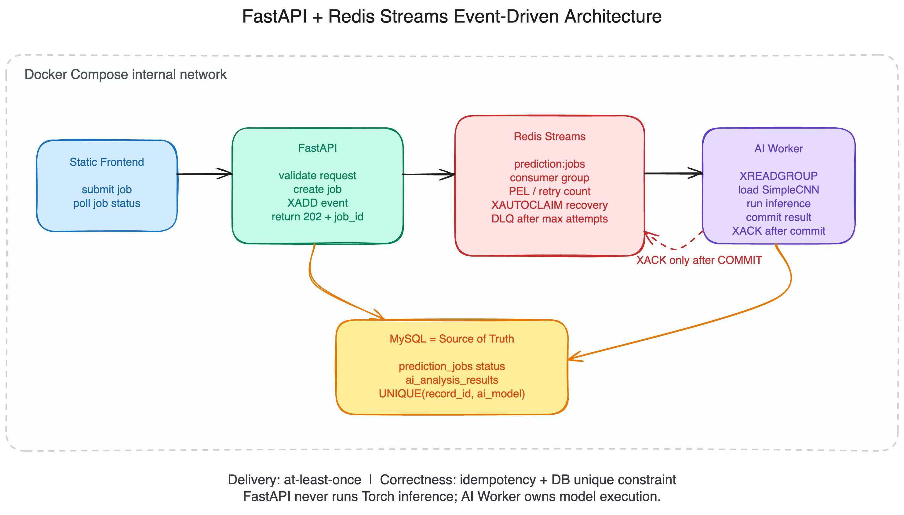

# 9일차: 동시성 문제 해결을 위한 Event-Driven Architecture 설계

작성일: 2026-09-03

대상 프로젝트: AI 기반 폐렴 예측 FastAPI 서비스

> **문서 상태:** 현재 코드를 분석해 작성한 목표 아키텍처 설계안이다. 이 문서 작성만으로 Redis, Worker, API 계약 또는 Compose 설정이 실제 구현된 것은 아니다. 현재 동기식 API 계약은 [`6일차_폐렴예측_API_설계.md`](./6일차_폐렴예측_API_설계.md)를 기준으로 한다.

## 1. 학습 목표

이 문서는 현재 프로젝트의 폐렴 예측 작업을 FastAPI 요청 처리 과정에서 분리하고, Redis를 작업 대기열로 사용해 여러 요청이 동시에 들어와도 안정적으로 처리하는 방법을 설계한다.

핵심 목표는 다음과 같다.

- FastAPI는 인증, 입력 검증, 작업 접수, 상태 조회만 담당한다.
- AI Worker는 PyTorch 모델 로딩과 추론을 전담한다.
- Redis Streams는 작업 전달, Consumer Group 분배, 미완료 작업 추적을 담당한다.
- MySQL은 작업 상태와 최종 예측 결과의 Source of Truth가 된다.
- 중복 전달을 허용하는 대신 멱등성(idempotency)과 DB 제약 조건으로 중복 추론 결과를 막는다.

## 2. Event-Driven Architecture란?

Event-Driven Architecture(EDA)는 한 컴포넌트가 다른 컴포넌트를 직접 호출해 완료될 때까지 기다리는 대신, 발생한 일을 이벤트로 발행하고 다른 컴포넌트가 이를 비동기로 소비하도록 구성하는 방식이다.

현재 서비스에 적용하면 `폐렴 예측을 실행하라`는 요청 자체를 오래 유지하지 않는다. FastAPI는 `예측 작업이 접수되었다`는 이벤트를 Redis에 기록하고 즉시 `job_id`를 반환한다. AI Worker는 자신의 처리 속도에 맞춰 이벤트를 읽고 모델 추론을 수행한다.

이 구조의 장점은 다음과 같다.

- API 응답 시간과 AI 추론 시간을 분리할 수 있다.
- 요청이 순간적으로 증가해도 Redis 대기열이 완충 장치 역할을 한다.
- Worker 수를 늘려 처리량을 독립적으로 확장할 수 있다.
- Worker가 처리 중 종료되어도 미완료 이벤트를 찾아 재처리할 수 있다.
- API 서버에 PyTorch 모델 실행 부하가 집중되지 않는다.

다만 EDA를 사용한다고 동시성 문제가 자동으로 사라지는 것은 아니다. 이벤트가 재전달될 수 있으므로 중복 처리 방지, 재시도 한도, 실패 격리, 상태 일관성을 함께 설계해야 한다.

## 3. 현재 프로젝트 분석

### 3.1 현재 동기식 흐름

현재 구현의 예측 흐름은 다음과 같다.

1. `static/pages.js`의 `handlePredict()`가 예측 API의 완료를 기다린다.
2. `static/apis.js`가 `POST /api/v1/medical-records/{record_id}/predict`를 호출한다.
3. `app/apis/prediction_apis.py`가 `app.worker.model.predict_xray`를 직접 주입한다.
4. `app/services/prediction_service.py`가 기존 결과를 조회한다.
5. 결과가 없으면 `asyncio.to_thread()`에서 PyTorch 추론을 실행한다.
6. `ai_analysis_results`에 결과를 저장한 후에야 HTTP 응답을 반환한다.

현재 `docker-compose.yml`에는 `fastapi`, `mysql` 서비스만 있고 Redis와 별도 Worker 서비스는 없다. 또한 `app/Dockerfile` 하나에 API 코드와 Torch 모델 의존성이 함께 들어간다.

### 3.2 예상되는 동시성 문제

같은 `record_id`에 대해 요청 A와 B가 거의 동시에 들어오면 다음 경쟁 조건이 생길 수 있다.

1. A가 기존 결과를 조회하고 `없음`을 확인한다.
2. B도 A의 커밋 전에 조회하므로 `없음`을 확인한다.
3. A와 B가 같은 X-Ray를 각각 추론한다.
4. 두 요청이 각각 결과 행을 저장한다.

따라서 현재의 `조회 후 생성(check-then-act)` 코드만으로는 중복 추론과 중복 결과 저장을 막을 수 없다. 그 밖에도 다음 문제가 있다.

- 오래 걸리는 추론 동안 HTTP 요청이 열린 상태로 남는다.
- API 프로세스의 CPU와 메모리를 웹 요청과 모델 추론이 경쟁한다.
- API 프로세스가 종료되면 실행 중 작업을 복구할 내구성 있는 작업 기록이 없다.
- 대기 작업 수가 보이지 않아 backpressure를 적용하기 어렵다.
- API 서버 수를 늘리면 각 프로세스에서 같은 작업을 실행할 가능성이 커진다.

FastAPI 공식 문서도 무거운 계산을 여러 프로세스나 서버에서 처리해야 할 때는 단순 `BackgroundTasks`보다 Redis 같은 큐 매니저를 사용하는 별도 작업 도구가 적합하다고 설명한다. ([FastAPI Background Tasks - Caveat](https://fastapi.tiangolo.com/tutorial/background-tasks/#caveat))

## 4. 대안 비교와 선택

| 대안 | 장점 | 한계 | 판단 |
| --- | --- | --- | --- |
| `BackgroundTasks` 또는 `asyncio.create_task()` | 구현이 가장 단순하다. | API 프로세스와 수명 및 자원을 공유하고, 프로세스 종료 시 작업 복구가 어렵다. | 작은 후처리에는 적합하지만 AI 추론에는 부적합하다. |
| Celery + Redis | 재시도, 스케줄링, 라우팅, 모니터링 생태계가 성숙했다. | Celery 설정과 운영 개념이 추가되고 현재 단일 작업에는 상대적으로 무겁다. | 작업 종류와 워크플로가 늘어나면 재검토한다. |
| Redis Streams + 전용 Worker | 이벤트 로그, Consumer Group, PEL, 명시적 ACK를 직접 제어할 수 있다. | 재시도와 DLQ 정책을 애플리케이션에서 구현해야 한다. | **현재 과제의 권장안**이다. |

Redis는 Celery의 broker와 result backend로도 사용할 수 있다. 다만 Celery에서 Redis broker의 재전달 시점은 visibility timeout 등 Celery 전송 계층의 설정을 함께 이해해야 한다. ([Celery - Using Redis](https://docs.celeryq.dev/en/stable/getting-started/backends-and-brokers/redis.html))

현재 프로젝트에는 예측 작업 한 종류만 존재하므로 우선 Redis Streams를 직접 사용한다. 이후 이메일 알림, 정기 작업, 여러 우선순위 큐, 복잡한 task canvas가 필요해지면 Celery 도입 비용이 정당화되는지 다시 판단한다.

## 5. 목표 아키텍처



> 위 이미지는 Excalidraw로 작성하고 PNG로 내보냈다. 편집 가능한 원본은 [`docs/images/9일차/event-driven-architecture.excalidraw`](./images/9일차/event-driven-architecture.excalidraw)이다.

### 5.1 컴포넌트 책임

| 컴포넌트 | 책임 | 하지 않는 일 |
| --- | --- | --- |
| Static Frontend | 예측 요청, `job_id` 보관, 상태 polling, 완료 결과 표시 | AI 추론을 기다리는 긴 HTTP 연결 유지 |
| FastAPI | 인증/인가, 진료기록·이미지 검증, 작업 행 생성, 이벤트 발행, 상태 조회 | Torch 모델 로딩 및 추론 |
| Redis Streams | 이벤트 순서 보존, Consumer Group 분배, PEL 기반 미완료 작업 추적 | 최종 업무 상태와 예측 결과의 영구 기준 역할 |
| AI Worker | 이벤트 소비, 멱등성 확인, 이미지 로드, 모델 추론, 결과 커밋, ACK | 사용자 HTTP 요청 처리 |
| MySQL | `prediction_jobs` 상태와 `ai_analysis_results` 결과 보관 | Worker에 작업을 직접 분배 |

## 6. API와 이벤트 계약

### 6.1 작업 접수 API

기존 API 경로를 유지하되 동기 결과 대신 작업 접수 결과를 반환한다.

```http
POST /api/v1/medical-records/{record_id}/predict
HTTP/1.1 202 Accepted
```

```json
{
  "job_id": "019c...",
  "record_id": 42,
  "status": "QUEUED",
  "reused": false,
  "status_url": "/api/v1/prediction-jobs/019c..."
}
```

동일한 `(record_id, ai_model)` 작업 또는 결과가 이미 있으면 새 작업을 만들지 않고 기존 `job_id`, 현재 상태, `reused: true`를 반환한다. 동시 INSERT의 UNIQUE 충돌은 트랜잭션을 rollback한 뒤 기존 행을 조회해 정상 응답으로 처리한다. 클라이언트가 네트워크 오류로 POST를 반복해도 같은 작업으로 수렴하도록 한다.

### 6.2 상태 조회 API

```http
GET /api/v1/prediction-jobs/{job_id}
```

```json
{
  "job_id": "019c...",
  "record_id": 42,
  "status": "RUNNING",
  "attempt_count": 1,
  "result": null,
  "error": null
}
```

완료 시에는 기존 `PredictionResponse` 형태의 결과를 `result`에 포함한다. 다른 사용자의 진료기록에 속한 작업 상태를 볼 수 없도록 현재 예측 API와 같은 인증·인가 규칙을 적용한다.

페이지 재진입 시 활성 작업을 찾을 수 있도록 다음 조회 계약도 둔다.

```http
GET /api/v1/medical-records/{record_id}/prediction-job
```

현재 모델의 최신 작업을 반환하고 작업이 없으면 `404`를 반환한다. Frontend는 URL이나 브라우저 저장소만 신뢰하지 않고 이 API로 상태를 복원한다.

### 6.3 Redis Stream 이벤트

Stream key는 `prediction:jobs`, Consumer Group은 `prediction-workers`로 정한다.

```json
{
  "event_version": "1",
  "job_id": "019c...",
  "record_id": "42",
  "model_name": "simple-cnn-v1",
  "model_revision": "sha256:...",
  "preprocess_version": "gray-128-v1",
  "run_generation": "1",
  "trace_id": "req-...",
  "created_at": "2026-09-03T12:00:00Z"
}
```

실제 Redis에는 위 객체를 하나의 JSON 문자열로 넣지 않고 `XADD`의 field/value 쌍으로 저장한다. 모든 값은 문자열로 직렬화한다.

이벤트에는 이미지 바이너리, 이메일, 환자 이름과 같은 개인정보를 넣지 않는다. Worker는 이벤트의 `record_id`를 그대로 신뢰하지 않고 `job_id`로 MySQL 작업을 읽은 뒤 `record_id`, 모델 revision, 전처리 version, 실행 generation이 일치하는지 검증한다. 그 다음 공유된 media volume에서 파일을 읽는다. 이벤트 형식 변경을 위해 `event_version`을 반드시 포함한다.

Consumer Group은 애플리케이션 시작 시 다음 명령과 같은 의미로 멱등 생성한다. `0`을 사용해 Group 생성 직전 이미 발행된 이벤트도 소비하며, 여러 인스턴스가 동시에 생성해서 발생한 `BUSYGROUP`은 정상 상태로 처리한다.

```text
XGROUP CREATE prediction:jobs prediction-workers 0 MKSTREAM
```

## 7. 처리 순서

1. Frontend가 예측 POST 요청을 보낸다.
2. FastAPI가 로그인 사용자, `record_id`, X-Ray 존재 여부와 파일 경로를 검증한다.
3. FastAPI가 MySQL에 `prediction_jobs` 행을 `PENDING` 상태로 커밋한다.
4. FastAPI가 `XADD prediction:jobs * ...`로 이벤트를 추가한다.
5. 발행 성공 시 `PENDING`인 행만 조건부로 `QUEUED`로 변경하고 `202 + job_id`를 반환한다.
6. AI Worker가 `XREADGROUP GROUP prediction-workers <consumer-name> ... >`로 새 이벤트를 읽는다.
7. Worker가 이벤트와 DB 행을 대조하고 조건부 UPDATE로 lease를 획득하면서 작업을 `RUNNING`으로 바꾼다.
8. lease를 획득한 Worker가 기존 완료 결과를 다시 확인한다. 결과가 있으면 작업 상태를 `SUCCEEDED`로 맞춘다.
9. 결과가 없다면 `SimpleCNN` 모델로 추론한다.
10. 하나의 MySQL 트랜잭션에서 현재 `lease_token`을 조건으로 결과를 저장하고 작업을 `SUCCEEDED`로 변경한다.
11. DB 커밋이 성공한 뒤에만 Redis에 `XACK`을 보낸다.
12. Frontend는 상태 API를 polling하다가 `SUCCEEDED`이면 결과를 표시한다.

Redis 공식 문서에 따르면 Consumer Group이 전달한 메시지는 PEL(Pending Entries List)에 남고, 소비자가 성공적으로 처리한 뒤 `XACK`해야 PEL에서 제거된다. 따라서 ACK를 DB 커밋보다 먼저 보내면 안 된다. ([Redis XREADGROUP](https://redis.io/docs/latest/commands/xreadgroup/), [Redis XACK](https://redis.io/docs/latest/commands/xack/))

## 8. 동시성 제어와 멱등성

### 8.1 전달 보장

이 설계의 전달 보장은 **at-least-once**이다. Worker가 DB 커밋 직후, `XACK` 직전에 종료되면 같은 이벤트가 다시 전달될 수 있다. 이를 `exactly-once`라고 표현하지 않는다.

대신 같은 이벤트가 여러 번 와도 최종 부작용은 한 번만 남도록 다음 방어 계층을 둔다.

1. `prediction_jobs`에 `(record_id, ai_model)` UNIQUE 제약 조건을 둔다.
2. `ai_analysis_results`에도 `(record_id, ai_model)` UNIQUE 제약 조건을 둔다.
3. Worker는 추론 전에 `SUCCEEDED` 작업 또는 기존 결과가 있는지 확인한다.
4. 결과 저장은 INSERT 실패를 그대로 재추론 실패로 취급하지 않고, UNIQUE 충돌이면 기존 결과를 읽어 성공으로 수렴한다.
5. 상태 변경은 무조건 덮어쓰지 않고 허용된 이전 상태를 조건에 포함한다.

예를 들어 API가 늦게 `QUEUED`를 기록하더라도 이미 `RUNNING`인 작업을 다시 `QUEUED`로 되돌리지 않도록 다음과 같이 상태 전이를 제한한다.

```text
PENDING -> QUEUED -> RUNNING -> SUCCEEDED
                         └----> RETRYING -> RUNNING
                         └----> FAILED
PENDING -> ENQUEUE_FAILED -> QUEUED
RUNNING -- lease 만료 --> RUNNING(새 owner, 새 lease_token)
```

### 8.2 같은 작업의 동시 실행 방지

Consumer Group은 새 메시지를 여러 Worker에 분배하지만, 장애 복구나 중복 발행으로 같은 `job_id`가 다시 올 수 있다. DB의 상태를 조건부 갱신하여 `PENDING`, `QUEUED`, `RETRYING` 작업 또는 lease가 만료된 `RUNNING` 작업을 한 Worker만 획득하도록 한다. `PENDING`을 허용하는 이유는 Redis 발행 직후 API가 `QUEUED`를 기록하기 전에 Worker가 이벤트를 읽는 짧은 경쟁 구간을 안전하게 처리하기 위해서다.

```sql
UPDATE prediction_jobs
SET status = 'RUNNING',
    worker_id = :worker_id,
    lease_token = :new_token,
    lease_expires_at = :lease_expires_at,
    started_at = COALESCE(started_at, NOW())
WHERE job_id = :job_id
  AND run_generation = :event_generation
  AND (
    status IN ('PENDING', 'QUEUED', 'RETRYING')
    OR (status = 'RUNNING' AND lease_expires_at < NOW())
  );
```

영향받은 행이 0개라면 다른 Worker가 유효한 lease로 처리 중이거나 이미 완료한 것이므로 현재 상태를 읽는다. `SUCCEEDED` 또는 같은 generation의 `FAILED`이면 ACK하고, 유효한 `RUNNING`이면 ACK하지 않은 채 현재 소비를 중단한다. 애플리케이션의 사전 조회만 믿지 않고 DB 제약 조건을 최종 방어선으로 사용한다.

### 8.3 Lease, heartbeat, fencing

`XAUTOCLAIM`은 Redis 메시지 소유권만 이전한다. MySQL의 `RUNNING` 소유권까지 안전하게 이전하려면 lease가 필요하다.

- Worker는 작업 획득 시 무작위 `lease_token`과 `lease_expires_at`을 기록한다.
- 추론이 lease 시간보다 길어질 수 있으므로 별도 heartbeat가 주기적으로 자신의 token과 일치하는 lease만 연장한다.
- 복구 Worker는 Redis PEL의 idle 시간이 기준을 넘고 MySQL lease도 만료된 경우에만 작업을 재획득한다.
- 결과 커밋은 `WHERE job_id = ? AND lease_token = ?` 조건을 사용한다. 이전 Worker가 늦게 돌아와도 새 Worker의 결과를 덮어쓸 수 없다. 이 조건을 fencing으로 사용한다.
- lease 시간, heartbeat 주기, `XAUTOCLAIM min-idle-time`은 실제 추론 시간 측정값으로 정하며 `heartbeat < lease < claim idle` 순서를 지킨다.

## 9. 장애 복구, 재시도, DLQ

### 9.1 Worker 종료 복구

Worker가 메시지를 읽고 ACK하지 못하면 이벤트는 PEL에 남는다. 각 Worker의 복구 루프는 주기적으로 `XAUTOCLAIM`을 호출해 일정 시간 이상 idle인 메시지의 Redis 소유권을 이전하고, MySQL lease가 만료된 경우에만 실제 작업을 재획득한다. `XAUTOCLAIM`은 pending 메시지의 전달 실패를 다루기 위한 명령이며, 재전달 횟수도 관찰할 수 있다. ([Redis XAUTOCLAIM](https://redis.io/docs/latest/commands/xautoclaim/))

heartbeat가 없는 단순 구현이라면 복구 기준 시간을 정상 예측의 p99 실행 시간보다 길게 설정한다. heartbeat를 적용한 목표 구현에서는 메시지 idle과 DB lease 만료를 모두 확인한다.

### 9.2 오류 분류

| 오류 유형 | 예시 | 처리 |
| --- | --- | --- |
| 재시도 가능 | Redis 일시 단절, MySQL deadlock, 일시적 I/O 오류 | 지수 backoff 후 제한 횟수 재시도 |
| 재시도 불가 | 이미지 없음/손상, 지원하지 않는 이벤트 버전, 존재하지 않는 record | 즉시 `FAILED`, 오류 코드 기록 |
| 독성 메시지 | 반복적으로 Worker를 실패시키는 이벤트 | 최대 횟수 후 `prediction:jobs:dlq`에 기록 |

재시도 가능한 오류가 발생하면 Worker는 MySQL에 `RETRYING`, 증가한 `attempt_count`, `next_retry_at`을 먼저 커밋한 뒤 원본 이벤트를 ACK한다. API와 별도로 실행되는 retry publisher가 `next_retry_at <= NOW()`인 행을 잠금 획득해 새 Stream 이벤트를 발행하고 조건부로 `QUEUED`로 바꾼다. 이 방식으로 backoff 시각은 MySQL에 남고, 원본 PEL을 장시간 점유하지 않는다. Worker가 오류 상태를 커밋하기 전에 죽은 경우는 앞 절의 `XAUTOCLAIM + lease` 복구 경로가 담당한다.

최대 재시도 횟수를 초과하면 원본 `job_id`, 오류 코드, 시도 횟수, 마지막 오류 시각을 DLQ Stream에 추가하고 MySQL 작업을 `FAILED`로 바꾼 다음 원본 이벤트를 ACK한다. DLQ 발행에 실패하면 ACK하지 않아 failure finalizer가 다시 처리하게 한다. 수동 재시도는 새 job 행을 만들지 않고 기존 `job_id`의 `run_generation`을 증가시켜 `PENDING`으로 되돌린다. 이전 generation 이벤트는 Worker가 DB와 대조해 ACK하고 무시한다.

### 9.3 MySQL과 Redis의 dual-write 문제

MySQL 커밋과 Redis `XADD`는 하나의 원자적 트랜잭션이 아니다. 다음 두 상황을 고려해야 한다.

- MySQL에는 `PENDING` 작업이 있지만 Redis 발행이 실패한 경우
- Redis 발행은 성공했지만 API가 `QUEUED`로 변경하기 전에 종료된 경우

과제 범위의 1단계에서는 MySQL을 먼저 커밋하고, FastAPI와 별도로 실행되는 reconciliation 루프가 다음 작업을 다시 발행한다.

- 일정 시간 이상 `PENDING` 또는 `ENQUEUE_FAILED`인 작업
- `next_retry_at`이 지난 `RETRYING` 작업
- 일정 시간 이상 `QUEUED`인데 시작되지 않은 작업
- Redis 재시작 후 PEL에는 없고 lease도 만료된 `RUNNING` 작업

reconciler는 `SELECT ... FOR UPDATE SKIP LOCKED`와 조건부 상태 변경으로 여러 인스턴스의 중복 선택을 줄인다. Redis에 이벤트가 남아 있는지 완벽히 원자적으로 판정할 수 없으므로 재발행 중복 자체는 허용하고, `job_id + run_generation`과 Worker 멱등성으로 안전하게 처리한다.

운영 환경으로 확장할 때는 같은 MySQL 트랜잭션에 `prediction_jobs`와 `outbox_events`를 함께 저장하는 **Transactional Outbox** 패턴을 적용한다. 별도 publisher가 미발행 outbox 행을 Redis에 전달하고 성공 여부를 기록한다. 이 방법도 중복 발행 가능성은 있으므로 Worker의 멱등성은 계속 필요하다.

## 10. MySQL 테이블 설계

새 `prediction_jobs` 테이블의 주요 컬럼은 다음과 같다.

| 컬럼 | 용도 |
| --- | --- |
| `job_id` | 외부에 노출할 UUID/UUIDv7 기본키 |
| `record_id` | `medical_records.id` FK |
| `ai_model` | `simple-cnn-v1`과 같은 모델 식별자 |
| `model_revision`, `preprocess_version` | 모델 artifact checksum과 전처리 계약 |
| `requested_by_user_id` | 요청 사용자 감사 및 상태 조회 인가 보조 정보 |
| `status` | PENDING, QUEUED, RUNNING, RETRYING, SUCCEEDED, FAILED, ENQUEUE_FAILED |
| `run_generation` | 수동 재시도와 오래된 이벤트 구분 |
| `attempt_count` | Worker 처리 시도 횟수 |
| `stream_entry_id` | Redis Stream entry 추적용 ID |
| `worker_id`, `lease_token`, `lease_expires_at` | 실행 소유권, heartbeat, fencing |
| `next_retry_at` | retry publisher가 확인할 재실행 시각 |
| `trace_id` | API 로그와 Worker 로그 연결 |
| `error_code`, `error_message` | 실패 분류와 운영 확인용 정보 |
| `created_at`, `started_at`, `finished_at` | 대기 시간과 처리 시간 측정 |

현재 서비스는 같은 모델의 기존 결과가 있으면 재사용하므로 `(record_id, ai_model)`을 UNIQUE로 둔다. 이때 하나의 `ai_model` 값은 특정 `model_revision + preprocess_version`에 불변으로 대응해야 하며, artifact 또는 전처리가 바뀌면 새 모델명을 사용한다. 향후 사용자가 동일 모델로 재분석할 수 있어야 한다면 `request_version` 또는 `image_checksum`을 멱등 키에 포함하는 것으로 정책을 변경한다.

## 11. Docker Compose 구성 전략

목표 Compose 서비스는 `fastapi`, `mysql`, `redis`, `ai-worker` 네 가지다.

```yaml
services:
  fastapi:
    build:
      context: .
      dockerfile: app/Dockerfile
    depends_on:
      mysql:
        condition: service_healthy
      redis:
        condition: service_healthy
    volumes:
      - .:/app
      - ./media:/app/media
    environment:
      REDIS_URL: redis://redis:6379/0

  ai-worker:
    build:
      context: .
      dockerfile: worker/Dockerfile
    command: python -m worker.main
    depends_on:
      mysql:
        condition: service_healthy
      redis:
        condition: service_healthy
    volumes:
      - ./media:/app/media:ro
    environment:
      REDIS_URL: redis://redis:6379/0
      WORKER_CONCURRENCY: "1"
    restart: unless-stopped
    stop_grace_period: ${WORKER_STOP_GRACE_PERIOD:-120s}

  redis:
    image: redis:7.4-alpine
    command: redis-server --appendonly yes --appendfsync everysec
    volumes:
      - redis_volume:/data
    healthcheck:
      test: ["CMD", "redis-cli", "ping"]
      interval: 5s
      timeout: 3s
      retries: 10

  mysql:
    # 현재 프로젝트 설정 유지

volumes:
  redis_volume:
```

위 YAML은 설계 예시이며 아직 현재 `docker-compose.yml`에 적용된 상태는 아니다. 실제 적용 시 이미지 버전은 팀에서 검증한 버전과 digest로 고정한다.

### 11.1 Redis 컨테이너 전략

- Redis의 `6379` 포트를 host에 공개하지 않고 Compose 내부 네트워크에서만 접근한다.
- `redis_volume`을 `/data`에 연결하고 AOF를 활성화한다.
- Redis 공식 문서에 따르면 AOF는 쓰기 연산을 기록하며, `everysec` 정책은 성능과 내구성의 절충안이다. 그래도 장애 직전 일부 쓰기 손실 가능성이 있으므로 MySQL 작업 행을 복구 기준으로 유지한다. ([Redis Persistence](https://redis.io/docs/latest/operate/oss_and_stack/management/persistence/))
- 운영 환경에서는 Redis ACL/비밀번호를 적용하고 secret을 이미지나 Git에 넣지 않는다.
- Stream을 단순 `MAXLEN`으로 강제 삭제하면 아직 pending인 이벤트를 잃을 수 있다. 보존 기간과 PEL 상태를 확인한 뒤 acknowledged된 오래된 항목을 정리한다.

### 11.2 AI Worker 컨테이너 전략

- API와 별도 프로세스 및 별도 서비스로 실행한다.
- `ai-worker` 프로세스 안에서 소비 루프와 함께 heartbeat, `XAUTOCLAIM`, retry publisher, reconciliation 루프를 비동기 maintenance task로 실행한다. DB row lock과 조건부 UPDATE를 사용하므로 Worker replica가 늘어나도 하나의 전역 leader에 의존하지 않는다.
- 목표 상태에서는 `worker/Dockerfile`을 분리해 Torch, torchvision, 모델 파일은 Worker 이미지에만 포함한다.
- FastAPI 이미지는 웹 API 의존성만 포함해 시작 시간과 이미지 크기를 줄인다.
- 현재 모델이 CPU 추론이므로 Worker 한 컨테이너의 concurrency를 우선 `1`로 둔다. 측정 없이 thread 수를 늘려 CPU oversubscription을 만들지 않는다.
- 처리량이 필요하면 `docker compose up --scale ai-worker=N`처럼 컨테이너 복제 수를 늘린다. Consumer 이름은 container hostname 등으로 고유하게 만든다.
- 개발 환경에서는 현재 프로젝트의 `./media`를 두 서비스의 `/app/media`에 같은 경로로 mount하고 Worker에서는 읽기 전용으로 사용한다. 업로드 완료 후 atomic rename된 파일만 작업으로 발행한다. 장기적으로 여러 host에서 실행한다면 로컬 volume 대신 object storage로 전환한다.
- 종료 신호를 받으면 새 메시지 읽기를 중단하고 진행 중인 작업의 DB 커밋과 ACK를 마칠 수 있도록 graceful shutdown을 구현한다. `stop_grace_period`는 측정한 추론 p99보다 충분히 크게 정한다.

### 11.3 개발 환경과 운영 환경의 차이

개발 환경에서는 현재처럼 소스 코드를 `/app`에 bind mount하고 FastAPI에 `--reload`를 사용할 수 있다. AI Worker에는 자동 reload를 적용하지 않는다. reload 과정에서 작업이 중단되고 재전달되는 현상이 테스트 결과를 혼란스럽게 만들 수 있기 때문이다.

운영 환경에서는 다음을 적용한다.

- 소스 bind mount와 `--reload` 제거
- API/Worker 이미지 분리 및 immutable tag 사용
- Redis 인증과 private network 적용
- CPU·memory limit 설정
- 로그에 `job_id`, `record_id`, `trace_id`, `consumer_name` 포함

## 12. Frontend 연동 전략

현재 `handlePredict()`는 POST 응답이 돌아오면 바로 `AI 예측이 완료되었습니다.`를 표시한다. 비동기 구조에서는 다음과 같이 바꾼다.

1. 버튼을 누르면 `predictPneumonia(recordId)`의 `job_id`를 받는다.
2. 버튼을 비활성화하고 `대기 중` 상태를 표시한다.
3. 상태 API를 1초, 2초, 최대 5초 간격으로 polling한다.
4. `QUEUED`, `RUNNING`, `RETRYING` 상태와 시도 횟수를 사용자에게 표시한다.
5. `SUCCEEDED`이면 기존 분석 목록을 다시 조회해 결과 표를 갱신한다.
6. `FAILED`이면 안전한 사용자용 오류 메시지를 표시하고 재시도 버튼을 활성화한다.
7. 페이지를 다시 열면 record별 최신 작업 조회 API로 활성 작업을 찾아 polling을 재개한다.

현재 과제 범위에서는 polling이 가장 단순하다. 실시간 진행률이 실제로 필요해질 때 SSE 또는 WebSocket을 추가한다. 작업 상태만 확인하는 단계에서 먼저 양방향 연결 복잡도를 도입하지 않는다.

## 13. Backpressure와 운영 관측

Worker 처리량보다 요청 유입량이 크면 Queue가 계속 증가한다. 따라서 다음 지표를 수집한다.

- `XLEN prediction:jobs`: Stream 보존량 참고 지표. ACK된 항목도 포함하므로 backlog로 단독 사용하지 않는다.
- `XPENDING prediction:jobs prediction-workers`: 미ACK 메시지 수
- 가장 오래된 pending 메시지의 idle time
- `prediction_jobs`의 QUEUED 건수와 가장 오래 기다린 시간
- 작업 성공률, 실패율, 재시도 횟수
- queue wait time과 inference duration의 p50/p95/p99
- Worker별 처리량, CPU, memory

admission control은 `XLEN` 하나가 아니라 MySQL의 `QUEUED` 수, 가장 오래된 대기 시간, `XPENDING`을 함께 사용한다. 운영 기준치를 넘으면 신규 작업에 `429 Too Many Requests`와 `Retry-After`를 반환하거나, 사용자별 활성 작업 수를 제한한다. Worker 수 증가는 CPU와 메모리 측정 결과에 따라 수행한다.

## 14. 테스트 전략

| 테스트 | 확인할 내용 |
| --- | --- |
| 동시 요청 테스트 | 같은 `record_id`로 20개 요청을 보내도 job/result가 각각 1개인지 확인 |
| Worker 강제 종료 | 추론 중 Worker를 종료한 뒤 PEL의 이벤트가 `XAUTOCLAIM`으로 복구되는지 확인 |
| RUNNING lease 만료 | 새 Worker가 만료된 작업을 재획득하고 새 `lease_token`을 받는지 확인 |
| 늦게 돌아온 Worker | 오래된 token을 가진 Worker의 결과 UPDATE가 0행으로 거부되는지 확인 |
| DB 커밋 후 ACK 전 종료 | 이벤트가 재전달되어도 기존 결과로 수렴하고 중복 행이 생기지 않는지 확인 |
| Redis 일시 중단 | `PENDING`/`ENQUEUE_FAILED` 작업이 복구 후 재발행되는지 확인 |
| Poison message | 최대 시도 후 DLQ로 이동하고 작업이 `FAILED`가 되는지 확인 |
| Scale-out | Worker를 여러 개 실행했을 때 서로 다른 consumer로 작업이 분배되는지 확인 |
| Backpressure | 대기열 기준 초과 시 API가 신규 작업을 제한하는지 확인 |
| 권한 테스트 | 다른 사용자가 타인의 `job_id` 상태를 조회할 수 없는지 확인 |

## 15. 단계별 구현 계획

1. `prediction_jobs` 모델과 Alembic migration을 추가한다.
2. `ai_analysis_results(record_id, ai_model)` UNIQUE 제약을 추가한다.
3. FastAPI에서 `predict_xray` 직접 import와 `asyncio.to_thread()` 호출을 제거한다.
4. Redis 연결, Stream 생성, Consumer Group 초기화를 추가한다.
5. 예측 POST를 `202 + job_id` 계약으로 변경하고 상태 조회 API를 추가한다.
6. `worker.main` 소비 루프, lease/heartbeat/fencing, graceful shutdown을 구현한다.
7. 재시도 분류, retry publisher, reconciliation 루프, `XAUTOCLAIM`, DLQ를 구현한다.
8. `redis`, `ai-worker` Compose 서비스를 추가한다.
9. Frontend polling 및 상태 UI를 연결한다.
10. 동시 요청 및 장애 복구 테스트를 자동화한다.
11. 운영 단계에서 Transactional Outbox와 모니터링을 추가한다.

## 16. 결론

현재 프로젝트의 가장 큰 문제는 FastAPI 요청 처리와 AI 추론이 같은 프로세스에 묶여 있고, 같은 진료기록에 대한 동시 요청을 DB 수준에서 막지 않는다는 점이다.

권장 구조는 **FastAPI가 작업을 접수하고, Redis Streams가 대기열을 관리하며, 별도 AI Worker가 추론하고, MySQL이 작업 상태와 결과의 기준이 되는 구조**다. 전달 자체는 at-least-once로 받아들이고, `job_id`, 조건부 상태 전이, 사전 확인, DB UNIQUE 제약을 함께 사용해 최종 결과를 한 번만 남긴다.

이 방식은 과제의 필수 조건인 FastAPI와 AI Worker의 명확한 분리, Redis 기반 작업 대기열 관리, 동시성 문제 해결 전략을 모두 만족한다.

## 참고자료

### 공식 문서

- [FastAPI - Background Tasks](https://fastapi.tiangolo.com/tutorial/background-tasks/)
- [Redis - XREADGROUP](https://redis.io/docs/latest/commands/xreadgroup/)
- [Redis - XACK](https://redis.io/docs/latest/commands/xack/)
- [Redis - XAUTOCLAIM](https://redis.io/docs/latest/commands/xautoclaim/)
- [Redis - Persistence](https://redis.io/docs/latest/operate/oss_and_stack/management/persistence/)
- [Celery - Using Redis](https://docs.celeryq.dev/en/stable/getting-started/backends-and-brokers/redis.html)

### 과제 제공 참고자료

- [OneUptime - Redis Streams with FastAPI](https://oneuptime.com/blog/post/2026-03-31-redis-fastapi-streams-event-processing/view)
- [Velog - FastAPI와 Celery로 AI Task 비동기 처리하기](https://velog.io/@nickygod/FastAPI-Celery로-AI-Task-비동기-처리하기)
- [Plain English - Mastering Background Job Queues with Celery, Redis and FastAPI](https://python.plainenglish.io/mastering-background-job-queues-with-celery-redis-and-fastapi-9eabb97c38af)

> Plain English 자료는 작성 시점에 본문 접근이 제한되어 제목과 공개된 범위만 확인했다. 핵심 기술 판단은 FastAPI, Redis, Celery 공식 문서와 현재 프로젝트 코드를 기준으로 작성했다.
